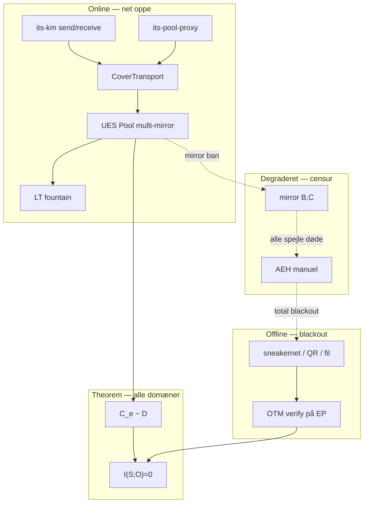
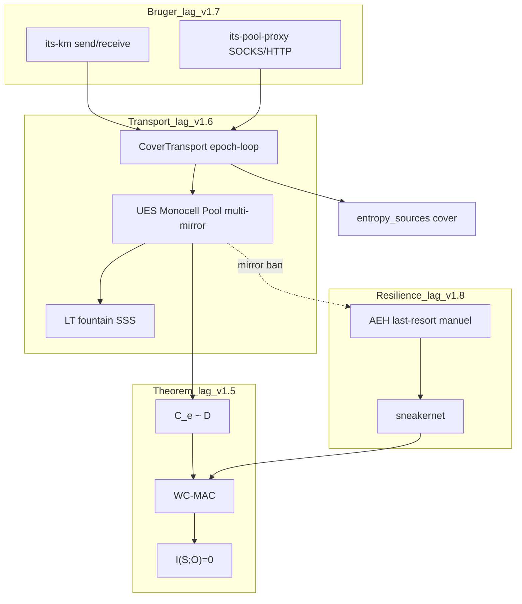
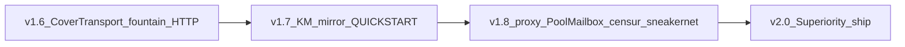

# ITS Dominance Plan — Bedre end I2P og Nym (v1.6 → v2.0)

**Status:** Shipped (`v2.0.0`, `verify_ecosystem` ALL CHECKS PASSED)  
**North star:** ITS skal **vinde over I2P/Nym på alle fronter** — online **og** når nettet går ned (sneakernet / total blackout).  
**Relateret:** [ITS-routing_SUPERIORITY.md](ITS-routing_SUPERIORITY.md) · [ITS-routing_CENSORSHIP_RECOVERY.md](ITS-routing_CENSORSHIP_RECOVERY.md) · [QUICKSTART.md](QUICKSTART.md)

---

## Thesis: Hvornår er ITS *objektivt* bedre?

Ikke når theoremet er smukkest — når **brugerens reelle behov** er bedre dækket **under aktiv Eve** med **mindre friktion** end overlay-mixnets.

ITS vinder når operatøren accepterer **secure endpoint**-disciplin og enten:
- bruger **offentlig pool-infrastruktur** (online), eller
- falder tilbage til **AEH → sneakernet** (offline / censur) **uden** at miste C/I.

I2P/Nym har **ingen** information-theoretic lane og **ingen** defineret offline-path med samme algebra.

---

## To driftsdomæner — begge skal vinde

| Domæne | I2P / Nym | ITS UES v2.0 |
|--------|-----------|--------------|
| **Online (net oppe)** | Overlay, relays, bridges, mix | UES Pool + CoverTransport + optional `its-pool-proxy` |
| **Degraderet (mirror-ban, censur)** | Bridges, flere tunnels, få udbydere | Fountain + `multi_pool_urls` → manuel AEH |
| **Offline (total blackout)** | **Stopper** — ingen overlay uden net | **Sneakernet** — analog/QR/fil-courier, samme wire + OTM |
| **C/I under alle tre** | Computational | **ITS** \(I(S;O)=0\) når OTM verify kører på sikker EP |



**Afgørende:** Universal egress er **ITS wire over pool** — ikke Tor-wrapper. Offline er **samme wire** på fysisk medium — ikke ny crypto.

---

## Målbare win-conditions (W1–W13 — alle grønne ved v2.0)

| # | Kriterium | I2P / Nym | ITS efter v2.0 | Verify |
|---|-----------|-----------|----------------|--------|
| W1 | **C/I under aktiv Eve** | Computational; Sybil angriber | **ITS** \(I(S;O)=0\) | `pipe_its_pool_e2e.sh`; Lean `UnifiedEpochStream.lean` |
| W2 | **Sybil 98% noder** | Deanonymisering mulig | **C/I uændret** — `SybilDoctrine` | Lean + pool pipe |
| W3 | **N=1 bruger** | Overlay k-anon kræver masse | **Size-independent** — `FewUserDoctrine` | Lean |
| W4 | **Kvantum / unlimited compute** | PQC-migration nødvendig | **MathSupremacy** | Lean |
| W5 | **Latency** | Multi-hop + mix-window | **0 hops, 1 epoch** | `epoch_interval_ms` i `config.prod.toml` |
| W6 | **Idle traffic leak** | Mulig når stille | **L3 konstant emit** — epoch-loop | `client.rs`; cover pipe |
| W7 | **Metadata/deltagelse (O⁺)** | Hops skjuler mønster | **CoverTransport** | `pipe_its_cover_harvest_e2e.sh`; L11–L12 |
| W8 | **Censur-overlevelse** | Bridges, tunnels, mange noder | **Fountain + multi-mirror + AEH + sneakernet** | censorship + sneakernet pipes |
| W9 | **One-command send** | VPN connect / I2P start | **`its-km send`** → pool default | `pipe_its_km_pool_e2e.sh` |
| W10 | **App-egress (browse/API)** | SOCKS, outproxy, tunneler | **`its-pool-proxy`** | `pipe_its_socks_pool_e2e.sh` |
| W11 | **Hidden addressing** | `.i2p`, Nym creds | **PoolMailbox** — OTM i ciphertext | `--mailbox-fingerprint` |
| W12 | **Offentlig infrastruktur** | Volunteer relays | **`deploy/pool-mirror/`** | `pipe_its_public_mirror_e2e.sh` |
| W13 | **Reproducerbar ship** | Releases, tags | **verify_ecosystem + v2.0.0 + 9 pipes** | `scripts/verify_ecosystem.sh` |

**v1.5** opfylder W1–W5 på papir. **v1.6–v2.0** lukker W6–W13 — det folk faktisk vælger I2P/Nym for.

---

## Domæne-sammenligning: Online vs offline vs I2P

| Front | Online (ITS) | Offline / sneakernet (ITS) | I2P (samme scenarie) |
|-------|--------------|----------------------------|----------------------|
| **Confidentiality** | \(I(S;O)=0\) i pool O | \(I(S;O)=0\) — O_net tom; payload på medium | Computational; overlay død offline |
| **Integritet** | OTM WC-MAC | OTM på fil/QR-bundle | Router-signaturer; offline = ingen leverance |
| **Latency** | 1 epoch (ms–100ms) | Courier-hastighed (menneske/disk) | Multi-hop online; offline = 0 |
| **UX send** | `its-km send` | `its-km send` → export fil/QR → fysisk overdragelse | I2P router + tunnel; offline = intet |
| **UX modtag** | `its-km receive --continuous` | Import fil → `its-km receive` / analog pipe | Hidden service kræver net |
| **Censur** | N mirrors + fountain | Sneakernet bypasser Eve helt | Afhænger af bridge-udbud |
| **Sybil** | Irrelevant for C/I | Irrelevant for C/I | Kritisk online |
| **N=1** | Size-independent | Size-independent | Kræver k-anon online |

**Konklusion domæne:** ITS er **stærkere i O** i begge domæner. I2P har **ingen** plan B med samme theorem når nettet er væk.

---

## Gap → Counter matrix (svar på “hvorfor ikke ITS?”)

| Folk vælger I2P/Nym fordi... | Hvad der skal til (leverance) | Fase |
|------------------------------|-------------------------------|------|
| “Det virker til browsing” | `its-pool-proxy` (SOCKS/HTTP lokal → encrypt → pool) | v1.8 |
| “Der er et netværk” | Reference `deploy/pool-mirror/` + `multi_pool_urls` prod-template | v1.7 |
| “Skjuler min ISP-metadata” | CoverTransport: pool **og** E-feeds hver epoch | v1.6 |
| “Overlever censur” | Fountain + 3+ mirrors + guided AEH-fallback | v1.6+v1.8 |
| “Nettet er nede” | Sneakernet + analog SSS + OTM verify | v1.5+v1.8 |
| “Én klik/install” | `its-km send` + QUICKSTART + `config.prod.toml` | v1.7 |
| “Hidden service” | PoolMailbox (ingen `.i2p`) | v1.8 |
| “Mange brugere = anonym” | Superiority-doc: aktiv Eve ≠ passiv ISP | v2.0 |
| “Battle-tested” | 9 E2E-pipes + offentlig mirror-spec | v2.0 |
| “Theorem ≠ binary” | Epoch-loop, fountain, HTTP prod-gates | v1.6 |
| “For komplekst” | Fjern UDP/onion fra primær README; én prod-sti | v2.0 |

---

## Arkitektur: Fire lag der slår mixnets



---

## Fase v1.6 — CoverTransport (O⁺-dominance)

### Leverancer

1. **`cover_transport.rs`** — `CoverHarvest::harvest_epoch()` = pool + alle `entropy_sources`
2. **Epoch-loop** — `epoch_interval_ms` wall-clock; **fjern `empty_passes`**
3. **`fountain_enabled`** — LT-kode i `epoch_cell.rs`
4. **`HttpPoolCourier` prod** — `ITS_PROD_GATE=1` ⇒ ingen fil-fallback
5. **Lean L11–L13** — `ParticipationSymmetry.lean`, `ComparativeThreatDoctrine.lean`
6. **Pipes:** `pipe_its_cover_harvest_e2e.sh`, `pipe_its_http_pool_e2e.sh`

### ParticipationSymmetry

| Postulat | Krav |
|----------|------|
| P1 | Pool **kun** via URLs der også bruges af benign masse (CDN, offentlig API, statisk blob) |
| P2 | Hver epoch: harvest pool + **alle** E-kanaler — også tom pool |
| P3 | Bob's O⁺-mønster ⊆ {DNS/NASA/news-læsere + mirror-klienter} |

**IP-geografi:** axiom for rå TLS — **deltagelses-korrelation** lukkes via P1–P3.

---

## Fase v1.7 — Product parity (slår “for svært”)

### 1. One-command UX

```bash
its-km send --contact bob --file doc.pdf      # default: encrypt + pool publish
its-km receive --contact alice                 # default: cover harvest + pool reconstruct
```

- Ratchet-seed håndteres internt i KM↔routing subprocess
- **Gate:** `pipe_its_km_pool_e2e.sh` uden manuel `export-ratchet-seed`

### 2. `config.prod.toml`

```toml
[pool]
transport_mode = "pool"
epoch_interval_ms = 100
multi_pool_urls = ["https://mirror1.example/epochs", "https://mirror2.example/epochs"]
fountain_enabled = true

[aeh]
entropy_sources = [
  "https://api.blockcypher.com/v1/btc/main",
  "https://eonet.gsfc.nasa.gov/api/v3/events/geojson"
]
```

### 3. Reference offentlig infrastruktur — `deploy/pool-mirror/`

- `POST /pool/cell?epoch=N` — publish fixed-size cell
- `GET /pool/cells?from=N` — harvest cells
- Deploy: nginx + static dir eller Cloudflare R2
- **Gate:** `pipe_its_public_mirror_e2e.sh`

### 4. `QUICKSTART.md`

5 minutter: bootstrap → `config.prod.toml` → `its-km send` → done.

---

## Fase v1.8 — Universal egress + PoolMailbox + offline dominance

### 1. `its-pool-proxy`

Lokal **SOCKS5** eller HTTP CONNECT → ITS wire → pool → Bob decrypt.

**Gate:** `pipe_its_socks_pool_e2e.sh`

### 2. PoolMailbox (hidden service uden `.i2p`)

| I2P | ITS PoolMailbox |
|-----|-----------------|
| `.i2p` destination i overlay | Ingen adresse i O; kun 𝒟-celler |
| Floodfill kender leaseSet | Ingen leaseSet; global pool |
| Sybil router | Sybil irrelevant for C/I |

### 3. Censorship recovery (guided — ikke auto-switch)

1. **Mirror A blocked** → `multi_pool_urls` prøver B, C (fountain)
2. **Alle mirrors blocked** → `its-km send --aeh` (manuel)
3. **Total blackout** → sneakernet

**Gate:** `pipe_its_censorship_recovery_e2e.sh`

### 4. Sneakernet — offline dominance over I2P

Når nettet er væk, er I2P **funktionelt død**. ITS fortsætter:

```bash
# Online path (normal)
its-km send --contact bob --file doc.pdf

# Offline path (blackout)
its-km send --contact bob --file doc.pdf --out-pool-bundle /media/usb/epoch_bundle.bin
# fysisk overdragelse →
its-km receive --contact alice --pool-bundle /media/usb/epoch_bundle.bin --out received.pdf
```

**Theorem:** \(O_{\text{net}} = \emptyset\); hemmelighed ligger i Shannon wire + OTM på sikker EP — **samme** som online.

**Gate:** `pipe_its_sneakernet_e2e.sh` (deletion-tolerance, O_net empty)

| | I2P offline | ITS sneakernet |
|--|-------------|----------------|
| Leverance | Ingen | Fil / QR / analog shares |
| C/I | N/A (intet leveret) | ITS fuld efter OTM verify |
| Operator playbook | Ingen | [ITS-routing_CENSORSHIP_RECOVERY.md](ITS-routing_CENSORSHIP_RECOVERY.md) §3 |

---

## Fase v2.0 — Superiority ship

### Dokumentation

| Dokument | Formål |
|----------|--------|
| [ITS-routing_SUPERIORITY.md](ITS-routing_SUPERIORITY.md) | W1–W13 + verify-kommandoer |
| [ITS-routing_PARTICIPATION_SYMMETRY.md](ITS-routing_PARTICIPATION_SYMMETRY.md) | O⁺-dominance |
| [ITS-routing_CENSORSHIP_RECOVERY.md](ITS-routing_CENSORSHIP_RECOVERY.md) | Operatør-playbook online→offline |
| [ITS_INFRASTRUCTURE_REPLACEMENT.md](ITS_INFRASTRUCTURE_REPLACEMENT.md) | v2.0 superiority table |
| **Dette dokument** | Master dominance-plan |

### README/vision

- **Primær sti:** pool → cover → its-km → optional proxy
- **UDP/onion:** dev-only footnote
- **Offline:** sneakernet som first-class resilience-lag

### Verify-gates v2.0 (9 pipes)

| Pipe | Beviser |
|------|---------|
| `pipe_its_pool_e2e.sh` | Kerne algebra |
| `pipe_its_cover_harvest_e2e.sh` | O⁺ symmetri |
| `pipe_its_http_pool_e2e.sh` | Prod HTTP uden fil |
| `pipe_its_public_mirror_e2e.sh` | Offentlig infra |
| `pipe_its_km_pool_e2e.sh` | One-command UX |
| `pipe_its_socks_pool_e2e.sh` | Universal egress |
| `pipe_its_censorship_recovery_e2e.sh` | Beat censur |
| `pipe_its_aeh_censorship_e2e.sh` | Last-resort AEH |
| `pipe_its_sneakernet_e2e.sh` | **Offline dominance** |

### Ship-kriterier v2.0.0 ✅

1. `verify_ecosystem.sh` → **ALL CHECKS PASSED**
2. `lake build` → 0 sorry (inkl. L11–L13)
3. Alle 9 pipes grønne
4. `config.prod.toml` + `deploy/pool-mirror/` i repo
5. Release: ingen `WIKI_STEGO`, ingen `empty_passes`, pool-first `--help`
6. W1–W13 linker til konkret kommando/pipe

---

## Hvad ITS gør *bedre* end I2P/Nym (alle fronter)

| Dimension | I2P / Nym svaghed | ITS styrke |
|-----------|-------------------|------------|
| **Trusselsmodel** | Passiv ISP ofte undervurderet | **Aktiv Eve** — theorem scope |
| **Sybil** | Kritisk for Tor-klasse | **Irrelevant** for C/I |
| **Brugerantal** | k-anon kræver kritisk masse | **N=1** i O |
| **Fremtidssikring** | PQC, parameter-rotation | **Information-theoretic** |
| **Latency (online)** | 200ms–sekunder | **Epoch-bound** (ms–100ms) |
| **Offline / blackout** | **Stopper** | **Sneakernet** — samme wire |
| **Infrastruktur-cost** | Mange relays | Statisk mirrors + E-feeds |
| **Censur** | Bridge-udbud | Fountain + N mirrors + AEH + sneakernet |
| **Kompromitteret relay** | Flow correlation | Eve ejer 100% — **0 bits** i O |
| **UX (fil/kontakt)** | Router + tunnel | **`its-km send/receive`** |
| **UX (browse)** | SOCKS outproxy | **`its-pool-proxy`** |

---

## Scope-guard

| Forbudt | Hvorfor | Alternativ |
|---------|---------|------------|
| Tor-wrapper som theorem | Bryder MathSupremacy | ITS wire over pool (v1.8) |
| Auto-switch P↔AEH | Selective participation leak | Guided censorship playbook |
| Isoleret 3-bruger pool | Provenance i O⁺ | Public mirror + cover |
| Chrome root CA i v2.0 | Ecosystem scope | its-pool-proxy for apps |
| “Bevis IP væk” | Umuligt | ParticipationSymmetry på deltagelse |

---

## Faser — rækkefølge



| Version | Fokus | Slår I2P/Nym på |
|---------|-------|-----------------|
| **v1.6** | Theorem→binary parity | W6, W7, W8 (delvist), W13 (delvist) |
| **v1.7** | Produkt + infrastruktur | W9, W12 |
| **v1.8** | App-egress + mailbox + censur + offline | W8, W10, W11 |
| **v2.0** | Dokumenteret dominance | **W1–W13 alle grønne** |

---

## Konklusion

ITS er **matematisk stærkere** end I2P/Nym under aktiv Eve — **online og offline**. Folk vælger mixnets for **produkt, netværkseffekt og zero-setup browsing** — ikke fordi algebraen taber.

**v2.0 gør ITS til det bedre alternativ** ved at:

1. **Shippe** det theoremet kræver (epoch-loop, cover, fountain, HTTP pool)
2. **Levere** det mixnets har (proxy, hidden addressing, one-click, offentlig infra)
3. **Bevise offline-dominance** med sneakernet-pipe når nettet er væk
4. **Gate** det med 9 pipes og W1–W13 — ikke vision alene

**Verifikation:**

```bash
./ROUTING/scripts/verify_math.sh          # M1–M8 math certificate (Lean only)
./ROUTING/scripts/verify_ecosystem.sh /home/user   # refinement + E2E pipes
```

---

## Math seal (lemma-ID → claim)

Master certificate: `mathematics/UnattackableCertificate.lean` — `./scripts/verify_math.sh`

| Win | Kriterium | Lean gate |
|-----|-----------|-----------|
| M1 | 0 `sorry` ROUTING + asymmetric | `lake build` |
| M2 | C1 af asymmetric Shannon — ikke stub MI | `Transport/WireComposition.lean` |
| M3 | I(author;O)=0 pakke | `AuthorAttributionZero.lean` |
| M4 | O⁺ lukket under P1–P3; IP axiom | `OplusClosure.lean`, `ObservationAlphabet.lean` |
| M5 | EP split encryptor vs verify | `EndpointSplit.lean` |
| M6 | Offline/sneakernet kanal-extension | `OfflineChannel.lean` |
| M7 | Ét master-certifikat | `UnattackableCertificate.lean` |
| M8 | Math-only verify script | `scripts/verify_math.sh` |

| Lemma | Claim |
|-------|-------|
| L1 | Wire Shannon + cell — `WireComposition.lean` |
| L2 | Integrity axiom — `IntegrityAxiom.lean` |
| L6–L7 | Link + AEH author-blind — `LinkParticipation.lean`, `PlausibleDeniability.lean` |
| L9 | Mode composition → master — `Transport/Composition.lean` |
| L10–L12 | O⁺ under postulates — `OplusClosure.lean` |
| Broadcast | Hop forward — `BroadcastForward.lean` |

Software refinement (`Refinement/EpochCellCorrectness.lean`, Rust pipes) er **udskudt** indtil M1–M8 alle grønne — nu math-sealed.

**Operatør-start:**

```bash
cp ROUTING/config.prod.toml ~/.its/routing.toml
its-km --true-secret ~/.its/km-vault-keys/true/secret.key send --contact bob --file doc.pdf
```
