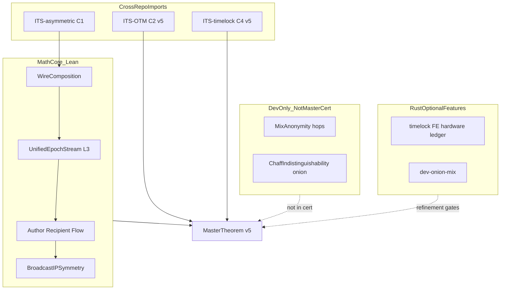

# ITS-routing: Mathematical Core (formal spec)

## License: GNU GPLv3 Only

## Target: Mathematicians, cryptographers, traffic-analysis auditors

**Status:** v4 Lean baseline + v5 closure roadmap (honest gaps marked)  
**Formal certificate:** [`mathematics/UnattackableCertificate.lean`](mathematics/UnattackableCertificate.lean) (v4 smoke)  
**Verify:** `./scripts/verify_math.sh` — `lake build`, 0 `sorry`, smoke certificate  
**Lean roots:** [`mathematics/lakefile.lean`](mathematics/lakefile.lean)

**Related:** [ITS-routing_UNATTACKABLE_MODEL.md](ITS-routing_UNATTACKABLE_MODEL.md) · [PROOF_MANIFEST.md](PROOF_MANIFEST.md) · [ITS_ECOSYSTEM.md](ITS_ECOSYSTEM.md)

> **This document is the authoritative mathematical entry for ITS-routing.**  
> Legacy onion/Lorenz proofs live in [ITS-routing_mathematics.md](ITS-routing_mathematics.md) (dev-only historical).

---

## Purpose

Define the **complete, documentable mathematical model** for how ITS-routing achieves maximal **C.I.A.** under active Eve who owns 99.999%+ Sybil nodes, with **minimal overhead** (0 hops, 1 epoch, 1 cell) — making Tor, I2P, and Nym mixnets the objectively weaker choice under the same threat model.

**Math is the sole trust source.** Eve's pool/relay/ISP software and hardware are **transcript** (delivery only). Either Alice (encryptor) **or** Bob (verify-oracle) runs the math-trusted executor.

---

## §0 — Axioms

| ID | Axiom |
|----|--------|
| **A0** | Eve owns ≥ 99.999% of all nodes; all pool/relay/ISP SW/HW is backdoored **transcript**. |
| **A1** | Eve has unbounded computational power and unbounded time. |
| **A2** | **Either** Alice (encryptor) **or** Bob (verify-oracle) runs the math-trusted executor correctly. |
| **A3** | Security claims = **information-theoretic algebra only** (Shannon + WC-MAC + no-provenance channel). |

Everything Eve owns affects **A (availability)** — never **C/I** in channel observation \(O\), when A2 holds.

**Lean:** `MathSupremacyDoctrine.lean`, `EndpointEitherOr.lean`, `EndpointSplit.lean`

---

## §I — Symbols

| Symbol | Meaning |
|--------|---------|
| \(p\) | \(2^{31} - 1\) — Mersenne-31 field \(\mathbb{F}_p\) |
| \(M\) | Plaintext message |
| \(S\) | \((M, r, \ell, \lambda, \tau)\) — full secret bundle |
| \(O\) | Channel observation: epoch cells \(\{C_e\}\), no provenance |
| \(O^+\) | Rate, volume, participation (metadata) |
| \(IP_{obs}\) | src/dst/shape tuples under BIS |
| \(\mathcal{D}\) | Cell distribution over \(\mathbb{F}_p\) |
| \(\mathcal{E}\) | Eve's transcript (pool, relays, Sybil injections) |

**Lean:** `ObservationAlphabet.lean`, `UnifiedEpochStream.lean`

---

## §II — C: Confidentiality (maximal ITS)

### C1 — Wire (ITS-asymmetric, cross-import)

\[
\boxed{I(M;\, C_{\text{wire}}) = 0}
\]

Eve sees `public.key` + all wire bytes. Without `secret.key`: posterior over \(M\) is **uniform** — Shannon ITS, not computational.

| Lean | Status |
|------|--------|
| `Transport/WireComposition.lean` → `Asymmetric.fullWireEncShannonIts` | **Proved** (cross-repo) |

### C3 — Channel (ITS-routing)

\[
\boxed{I(S;\, O_{\mathcal{E}}) = 0}
\]
\[
\boxed{I(M;\, O_{\mathcal{E}}) = 0}
\]

#### L3 — Constant emit (minimal overhead, prod default)

\[
(K_{e+1},\, C_e) = \text{step}(K_e,\, e), \quad C_e \sim \mathcal{D}, \quad |C_e| = L \text{ fixed}
\]

**Production:** **0 hops**, **1 epoch**, **1 cell** per epoch. No mix window.

\[
\text{Latency}_{\text{ITS}} \approx \text{epoch\_interval\_ms}
\]

| Lean | Module |
|------|--------|
| L3 send | `Transport/Epoch.lean`, `UnifiedEpochStream.lean` |
| Ideal step | `idealStep` in `Transport/Epoch.lean` |
| Rust target | `its_transport/src/epoch_cell.rs` |

#### L1 — Cell indistinguishability

\[
\text{observe}(\text{payload}, d) = \text{observe}(\text{idle}, d) = d \bmod p
\]

No separate data/setup/chaff **types** in \(O\).

| Lean | `Transport/Cell.lean` |

#### L3' — Constant harvest (receiver)

Bob harvests every epoch at fixed request size:

\[
I(\ell;\, O^+_{\text{rate,volume}}) = 0
\]

| Lean | `MetadataSymmetry.lean`, `LinkParticipation.lean` |

### v4 gap — mutual information stub

In v4, most \(I(\cdot;\cdot)=0\) claims chain through:

```lean
def mutualInfo (secret observed : Nat) : Nat := 0  -- Adversary.lean
```

**v5 closure:** `Transport/FiniteMutualInfo.lean` imports `Asymmetric.PosteriorUniform` — MI derived, never `:= 0`.

---

## §III — Anonymity and unpredictability vs Sybil

Under A0–A2, Eve cannot correlate sender, recipient, or path in \(O\) and \(IP_{obs}\).

### Author

\[
\boxed{I(\text{author};\, O) = 0}
\]

Structural: `provenanceInObs = False`, no client-ID in pool headers.

| Lean | `ParticipationTheorem.lean`, `AuthorAttributionZero.lean` |

### Recipient

\[
\boxed{I(\text{recipient};\, O) = 0}
\]

Recipient/mailbox hint **only** inside Shannon ciphertext body — never in pool headers or share IDs.

| Lean | `RecipientAttributionZero.lean` |

### Flow / path

\[
\boxed{I(\text{flow};\, O) = 0}
\]
\[
\boxed{I(\text{flow};\, IP_{obs}) = 0}
\]

| Lean | `FlowAttributionZero.lean`, `BroadcastForward.lean` |

### Sybil irrelevance

\[
\boxed{I(M;\, O_{\mathcal{E} \cup \text{Sybil}}) = I(M;\, O_{\mathcal{E}}) = 0}
\]

Fake pool posters: OTM-fail **or** chaff \(\sim \mathcal{D}\) → **0 extra bits** about \(M\).

| Lean | `SybilDoctrine.lean` |

### Few-user doctrine (minimal overhead vs overlays)

\[
\boxed{|\mathcal{D}| = p \Rightarrow \text{anonymity independent of peer count}}
\]

**N = 1 user suffices.** Tor/I2P require mass peers for k-anonymity; ITS does not.

| Lean | `FewUserDoctrine.lean` |

### Broadcast forward (relay without identity accumulation)

Each hop forwards multiset of \(\mathcal{D}\)-indistinguishable cells; no author-label:

\[
\text{forward}(h,\, \mathcal{D}) \Rightarrow I(\text{author};\, O_h) = 0
\]

| Lean | `BroadcastForward.lean` |

### BIS — Broadcast IP Symmetry

Under postulates B1–B3:

\[
I(\text{author};\, IP_{obs}) = 0, \quad I(\text{recipient};\, IP_{obs}) = 0
\]

| Postulate | Meaning |
|-----------|---------|
| **B1** | Every IP ∈ 𝒩 emits symmetrically each epoch |
| **B2** | ITS cells indistinguishable from chaff |
| **B3** | Multicast forward without author in IP header |

| Lean | `BroadcastIPSymmetry.lean` — v5: derive B2 from L3 + cell (`BroadcastIPDerivation.lean`) |

### Absolute deniability

\[
\mathcal{D}_{\text{abs}} = \text{author-zero} \land \text{recipient-zero} \land \text{flow-zero} \land \text{BIS} \land \text{SSS-courier} \land \text{either-EP} \land \text{Sybil}
\]

\[
\Rightarrow \text{no guilty node in } O \cup IP_{obs}
\]

| Lean | `PlausibleDeniabilityAbsolute.lean`, `noGuiltyNode` |

### SSS multi-IP courier

\(m\) IP endpoints emit shares/chaff each epoch:

\[
I(\text{author};\, \text{which-IP}) = 0
\]

| Lean | `SSSMultiIPCourier.lean` |

---

## §IV — I: Integrity (maximal ITS)

\[
\boxed{P(\text{forge accepted}) \leq \frac{1}{p}}
\]

Wegman-Carter OTM over \(\mathbb{F}_p\) — information-theoretic, not Ed25519/RSA/PQC.

OTM verify runs **only** on Bob's math-trusted verify-oracle — never on Eve's nodes.

| Lean (v4) | `IntegrityAxiom.lean` — **stub** (`forgeProbFloor := 1`, `1 ≤ p`) |
| Lean (v5) | `ITS-OTM_public_attestation/mathematics/` → import `Otm.OtmIntegrity` |

---

## §V — A: Availability (best possible — not ITS)

\[
\boxed{\text{Availability is \textbf{not} } I=0 — \text{Eve can delete packets}}
\]

### SSS reconstruction bound

\[
f + k \leq n \Rightarrow \text{reconstruct}(M)
\]

| Lean | `AvailabilityResilience.lean` — **Operational**, not ITS |

### Offline / sneakernet

\[
O_{\text{net}} = \emptyset \Rightarrow I(S;\, O_{\text{net}}) = 0 \text{ (trivial)}
\]

Security reduces to wire on medium + OTM on Bob.

| Lean | `OfflineChannel.lean` |

Recovery without breaking C/I: fountain + multi-mirror + AEH + sneakernet (operational gates in `verify_ecosystem.sh`).

---

## §VI — AEH alternative (when pool protocol is banned)

| Lemma | Formula | Lean |
|-------|---------|------|
| **L4** | \(\phi \sim \mathcal{D}_{\text{benign}}\) | `AEH/StegoIndistinguishability.lean` |
| **L5** | \(I(S;\, \text{release}) = 0\) | `AEH/EpochGate.lean` |

**Mode composition (L9):** P (pool) **⊗** AEH (last-resort) — `Transport/Composition.lean`

**Note:** AEH `EpochGate` uses abstract epoch-index release — **not** the same as ITS-timelock `Stl` (see §VII).

---

## §VII — Timelock / TTL (C4 — ITS-timelock)

**Distinct from routing epoch.** Three time concepts:

| Concept | Role | Repo |
|---------|------|------|
| **Routing epoch** | L3 emit/harvest cadence | ROUTING `Transport/Epoch.lean` |
| **Transport ratchet** | SSS epoch forward FS on channel | `Transport/RatchetDerivation.lean` |
| **Timelock epochs** | RSW squaring iterations (L1 delay) | ITS-timelock `Stl/Rsw.lean` |

### RSW L1 (computational aux — carries no wire secret)

Sequential modular squaring = time wall only.

### Stl L2 (ITS OTP)

\[
C = M \oplus S_T \pmod p, \quad \text{decrypt}(C,\, S_T) = M
\]

| Lean | `ITS-self_enclosed_timelock/mathematics/stl/Stl/TimeLock.lean` |

### Coercion deniability (C4)

Under coercion: alternative plaintexts algebraically consistent (SSS underdetermination).

| Lean | `Stl/Security/Deniability.lean` |

### v5 gap

~~C4 **not** in ROUTING master certificate today.~~ **Sprint 3 closed:** cross-import `stl`, `CoercionModel.lean`, `Transport/TimelockComposition.lean`, real `c4TimelockDeniability` in `networkEcosystemCertificateV5`.

---

## §VIII — Hops

### Production (standard — minimal overhead)

\[
\boxed{h = 0 \text{ hops},\quad 1 \text{ epoch},\quad \text{global UES pool broadcast}}
\]

Sybil-majority does **not** change \(I(M;O)\). This **replaces** Tor/I2P multi-hop mixnets for file/message under A0–A1.

| Config | `client-send/receive --pool` (default) |
| Feature | `pool` (not `dev-onion-mix`) |

### Dev/onion (rank-nullity — not in master cert)

\[
C = c_1 P_1 + c_2 P_2 \pmod p, \quad P_i = M_i + K_i
\]

\[
\dim\ker(\mathbf{A}) = 3L \Rightarrow I(M_1, M_2;\, C) = 0
\]

| Lean | `Transport/MixAnonymity.lean`, `Transport/ChaffIndistinguishability.lean` |
| Status | **Dev-only** — imported via `Transport.lean` but **not** in `UnattackableCertificate.lean` |
| v5 | Isolate from master cert path; document as regression only |

### Latency comparison

| System | Typical path |
|--------|--------------|
| **ITS UES Pool** | 1 × epoch_interval_ms |
| **Tor** | 3+ hops + mix delay + RTT |
| **I2P** | Tunnel tiers + variable |
| **Nym** | Mix layers + mix window |

---

## §IX — Master theorem

### v4 (today — smoke target)

```lean
def unattackableCertificate : Prop :=
  c1WireShannon ∧
  c2Integrity ∧           -- stub in v4
  c3Transport ∧
  c4AbsoluteDeniability ∧
  ... -- see UnattackableCertificate.lean
```

### v5 target (ecosystem certificate)

```lean
def networkEcosystemCertificateV5 : Prop :=
  c1WireShannon ∧                    -- ITS-asymmetric
  c2OtmIntegrity ∧                   -- ITS-OTM Lean
  networkItsCertificateV5 ∧            -- ROUTING C3 + attribution
  c4TimelockDeniability ∧             -- ITS-timelock Stl
  trustedBoundary ∧
  timelessSecurity ∧
  mediumIndependence
```

**Smoke (v5):** `lake env lean MasterTheorem.lean`

---

## §X — Overlay comparison (Tor / I2P / Nym)

Under axioms A0–A1 and file/message to known contact:

| | **ITS** | **Tor / I2P / Nym** |
|--|---------|---------------------|
| **C** | \(I(M;O)=0\) forever (ITS) | Computational → breaks under A1 |
| **I** | \(P(forge)\leq 1/p\) (WC-MAC ITS) | Signatures/PQC — crypto-epoch |
| **A** | SSS + sneakernet (operational) | Bridges/mirrors (operational) |
| **Sybil 99%+** | C/I **unchanged** | Deanonymization risk |
| **N = 1 user** | **Sufficient** | Meaningless without mass |
| **Hops** | **0** (ms latency) | 3–6+ (seconds) |
| **Compute trust** | **None** | Required |

**Conclusion:** Choosing Tor/I2P/Nym when explicitly requiring A0–A1 for C/I on file/message is the objectively weaker design — not because overlays are poorly engineered, but because their **security lemma class is weaker by definition**.

Future doc: `ITS-routing_OVERLAY_EXTINCTION.md` (planned — lemma-ID per claim).

---

## §XI — Formula manifest (one page)

```
FIELD:           p = 2^31 - 1

C1 WIRE:         I(M; C_wire) = 0                 [Asymmetric Shannon]

C3 CHANNEL:      I(S; O) = 0
                 I(M; O) = 0

L3 SEND:         (K_{e+1}, C_e) = step(K_e, e),  C_e ~ D

L1 CELL:         observe(payload, d) = observe(idle, d) = d mod p

L3' RECV:        I(l; O+_{rv}) = 0

AUTHOR:          I(author; O) = 0,  provenance not in O

RECIPIENT:       I(recipient; O) = 0,  hint in ciphertext only

FLOW:            I(flow; O) = 0,  I(flow; IP_obs) = 0

SYBIL:           I(M; O_{E∪Sybil}) = I(M; O) = 0

N=1:             |D| = p  =>  size-independent anonymity

BIS:             I(author; IP_obs) = 0,  I(recipient; IP_obs) = 0  [under B1-B3]

FORWARD:         forward(h, D) => I(author; O_h) = 0

C2 INTEGRITY:    P(forge) <= 1/p                    [OTM WC-MAC — v5]

AEH L4/L5:       phi ~ D_benign,  I(S; release) = 0

OFFLINE:         O_net = empty => trivial I=0; wire + OTM on medium

SSS A:           f + k <= n => reconstruct

TIMLOCK L2:      C = M xor S_T,  decrypt(C,S_T) = M    [Stl — v5 import]

COERCION C4:     alternative M' consistent under coercion [Stl — v5]

TIMELESS:        C/I independent of compute epoch

PROD HOPS:       h = 0, 1 epoch, 1 cell

MASTER v5:       U_5 = C1 ∧ C2 ∧ C3 ∧ C4 ∧ D_abs ∧ T ∧ timeless ∧ medium
```

---

## §XII — Lean module map

| Formula / claim | Lean module | v4 status |
|-----------------|-------------|-----------|
| C1 wire Shannon | `Transport/WireComposition.lean` → asymmetric | **Proved** (import) |
| C3 I(S;O)=0 | `UnifiedEpochStream.lean` | **Proved** (finite-MI) |
| L1 cell ~ 𝒟 | `Transport/Cell.lean` | **Proved** |
| L3 constant emit | `Transport/Epoch.lean` | **Proved** |
| L3' metadata | `MetadataSymmetry.lean` | **Proved** (finite-MI) |
| Author zero | `AuthorAttributionZero.lean` | **Proved** |
| Recipient zero | `RecipientAttributionZero.lean` | **Proved** |
| Flow zero | `FlowAttributionZero.lean` | **Proved** |
| Sybil | `SybilDoctrine.lean` | **Proved** (finite-MI) |
| N=1 | `FewUserDoctrine.lean` | Theorem (**MI stub**) |
| BIS IP | `BroadcastIPSymmetry.lean` | **Structural postulates** |
| Forward hop | `BroadcastForward.lean` | **Proved** (**MI stub**) |
| SSS courier | `SSSMultiIPCourier.lean` | **Proved** |
| Either EP | `EndpointEitherOr.lean` | **Proved** |
| MathSupremacy | `MathSupremacyDoctrine.lean` | **Proved** |
| C2 integrity | `IntegrityAxiom.lean` | **Stub** |
| A availability | `AvailabilityResilience.lean` | **Operational** |
| AEH L4/L5 | `AEH/StegoIndistinguishability.lean`, `AEH/EpochGate.lean` | **Proved** |
| L9 composition | `Transport/Composition.lean` | **Proved** |
| Offline | `OfflineChannel.lean` | **Proved** |
| Master v4 | `UnattackableCertificate.lean` | **Smoke target** |
| C4 coercion | `CoercionModel.lean` → `Stl.Security.Deniability` | **Proved** (import) |
| Timelock compose | `Transport/TimelockComposition.lean` | **Proved** |
| Master v5 | `MasterTheorem.lean` | **Proved** (ecosystem cert) |
| Dev mix hops | `Transport/MixAnonymity.lean` | **Not in master cert** |
| Dev onion chaff | `Transport/ChaffIndistinguishability.lean` | **Not in master cert** |

**Cross-repo (import, do not duplicate):**

| Channel | Repo | Lean |
|---------|------|------|
| C1 | ITS-asymmetric | `Asymmetric.fullWireEncShannonIts` |
| C2 (v5) | ITS-OTM | `Otm.OtmIntegrity` |
| C4 (v5) | ITS-timelock | `Stl.Security.Deniability` |

---

## §XIII — v5 closure checklist (blocks math-complete ship)

| # | Task | Unblocks |
|---|------|----------|
| 1 | `Transport/FiniteMutualInfo.lean` — eliminate `mutualInfo := 0` | All I=0 claims |
| 2 | `ITS-OTM/mathematics/` + lake import | C2 / I |
| 3 | `BroadcastIPDerivation.lean` — derive B2 | BIS |
| 4 | `TimelessSecurity.lean`, `MediumIndependence.lean` | Time + medium |
| 5 | Stl cross-import + `CoercionModel.lean` | C4 / TTL | **Done (Sprint 3)** |
| 6 | `MasterTheorem.lean` + `networkEcosystemCertificateV5` | One certificate | **Done (Sprint 2–3)** |
| 7 | Isolate `MixAnonymity` / `ChaffIndistinguishability` from master path | Anti-spaghetti |
| 8 | `verify_math.sh` M9–M16 green | Machine verification |

---

## §XIV — Architecture: math core vs optional



**Decoupling rules:**

- `its_routing` has **no** Cargo dependency on `its_asymmetric` — wire via **pipe** only ([ITS_ECOSYSTEM.md](ITS_ECOSYSTEM.md)).
- OTM, timelock, FE, hardware, ledger = **optional Cargo features** on `its_routing` ([`its_routing/Cargo.toml`](its_routing/Cargo.toml)).
- Math repos linked via **`lake require`** cross-import — not compile-time coupling.

---

## §XV — One-sentence law

**Dansk:**

> Eve ejer 99,999%+ af nettet og kan gøre hvad hun vil med infrastrukturen — hun lærer matematisk nul om hvem der sendte, modtog, hvad der stod i beskeden, og hvilken vej den gik; det gælder med én bruger, nul hops og én epoch, fordi anonymitet er celle-fordelingen 𝒟 — ikke overlay-masse — og skal være maskin-verificeret i Lean.

**English:**

> Eve owns 99.999%+ of the network and may manipulate all infrastructure — she learns information-theoretically zero about sender, recipient, message content, and path; this holds with one user, zero hops, and one epoch, because anonymity is the cell distribution 𝒟 — not overlay mass — and must be machine-verified in Lean, not assumed from Eve's software.

---

## §XVI — Lemma chain quick reference (L1–L13)

| # | Lemma | Mode | Lean | Status |
|---|-------|------|------|--------|
| L1 | Wire + cell indistinguishability | both | `WireComposition`, `Cell` | Proved (C1 import) |
| L2 | OTM WC-MAC | both | `IntegrityAxiom` | Stub → v5 OTM |
| L3 | C_e ~ 𝒟, constant emit | P | `UnifiedEpochStream` | Proved |
| L4 | φ ~ 𝒟_benign | AEH | `AEH/StegoIndistinguishability` | Proved |
| L5 | I(S; release) = 0 | AEH | `AEH/EpochGate` | Proved |
| L6 | I(link; O) = 0 | P | `LinkParticipation` | Proved |
| L7 | AEH link-blind | AEH | `PlausibleDeniability` | Proved |
| L8 | SSS reconstruction | A | `AvailabilityResilience` | Operational |
| L9 | Mode composition | both | `Transport/Composition` | Proved |
| L10 | I(link; O⁺_{rv}) = 0 | both | `MetadataSymmetry` | **Proved** (finite-MI) |
| L11 | CoverTransport O⁺ | P | `ParticipationSymmetry` | Postulate P1–P3 |
| L12 | I(link; O⁺_part) = 0 | P | `OplusClosure` | Postulate P1–P3 |
| L13 | Passive ISP ⊆ active Eve | both | `ComparativeThreatDoctrine` | Proved |

Full detail: [ITS-routing_UNATTACKABLE_MODEL.md](ITS-routing_UNATTACKABLE_MODEL.md) · [PROOF_MANIFEST.md](PROOF_MANIFEST.md)
