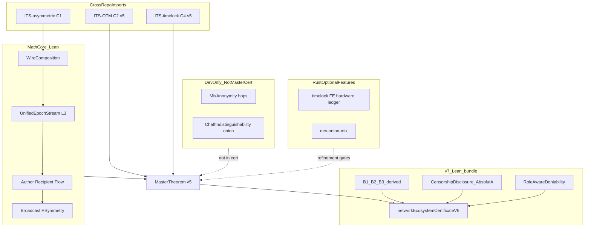

# ITS-routing: Mathematical Core (formal spec)

## License: GNU GPLv3 Only

## Target: Mathematicians, cryptographers, traffic-analysis auditors

**Status:** v10 implementation certificate **proved** — v9 ideal + refinement bundle (`networkImplementationCertificateV10`)  
**Formal certificate:** [`mathematics/MasterTheoremV6.lean`](mathematics/MasterTheoremV6.lean) — `networkEcosystemCertificateV9` (M1–M20) · `networkImplementationCertificateV10` (M23–M26)  
**Verify:** `./scripts/verify_math.sh` — M1–M26, `lake build`, 0 `sorry`, smoke certificates + refinement
**Lean roots:** [`mathematics/lakefile.lean`](mathematics/lakefile.lean) — `routing-math-cert` · `routing-math-dev` · `routing-math-refinement`

**Related:** [ITS-routing_UNATTACKABLE_MODEL.md](ITS-routing_UNATTACKABLE_MODEL.md) · [PROOF_MANIFEST.md](PROOF_MANIFEST.md) · [ITS_ECOSYSTEM.md](ITS_ECOSYSTEM.md)

> **Reviewer entry:** [ITS-routing_mathematics.md](ITS-routing_mathematics.md) — §0.1 worked example, postulates, confirm/reject checklist (same structure as ITS-asymmetric / SSS_CHAIN).  
> **This document** is the extended proof map (M1–M26, scenarios, BIS, timelock composition). Dev-only onion/mix proofs: `dev-onion-mix` feature — not production cert path.

---

## Purpose

Define the **documentable mathematical model** for ITS-routing **C · I · A** under active Eve (A0–A3), with production parameters **0 hops, 1 epoch, 1 cell**. Claims are classified in §Expectations: **Proved**, **Import**, **Assumption**, **Conditional**, **Outside**, **Operational**.

**Math is the sole trust source.** Eve's pool/relay/ISP software and hardware are **transcript** (delivery only). Per message pair, **either** the sender (encryptor) **or** the receiver (verify-oracle) runs the math-trusted executor — Alice–Bob, Alice–Charlie, or any ITS endpoint pair (A2′).

---

## §0 — Axioms

| ID | Axiom |
|----|--------|
| **A0** | Eve owns ≥ 99.999% of all nodes; all pool/relay/ISP SW/HW is backdoored **transcript**. |
| **A1** | Eve has unbounded computational power and unbounded time. |
| **A2** | **Either** the sender (encryptor) **or** the receiver (verify-oracle) runs the math-trusted executor correctly — per message pair. |
| **A2′** | $\text{SecureEncryptor}(\text{sender}) \lor \text{SecureVerifyOracle}(\text{receiver})$ for **any** ITS pair (Alice–Bob, Alice–Charlie, …). Charlie as third ITS reader/witness is in scope. |
| **A3** | Security claims = **information-theoretic algebra only** (Shannon + WC-MAC + no-provenance channel). |

Everything Eve owns affects **A (availability)** — never **C/I** in channel observation $O$, when A2/A2′ holds.

**Outside (minimal, explicit):** both endpoints compromised before channel; side-channels; physical coercion on unsecured device; $O_{\text{net}}=\emptyset$ total blackout (sneakernet recovery — not silent online pool censorship).

**Lean:** `MathSupremacyDoctrine.lean`, `EndpointEitherOr.lean`, `EndpointSplit.lean`

---

## §0b — Endpoint scope (A2′)

For each message pair $(s, r)$:


$$
\text{SecureEncryptor}(s) \lor \text{SecureVerifyOracle}(r)
$$


**Example:** Alice hosts content; Bob₁…Bobₙ and Charlie (witness) harvest via public pool — A2′ applies per pair (Alice–Bobᵢ, Alice–Charlie). Compromise of **both** endpoints in a pair is **Outside** channel C/I.

**Lean:** `EndpointEitherOr.lean`, `EndpointSplit.secureEndpointAxiom` (Outside boundary)

---

## §0c — MathSupremacy (evil SW/HW can / cannot)

Under A0, Eve owns pool relay ISP SW/HW — all are **transcript** (delivery only).

| Evil SW/HW **can** (A only) | Evil SW/HW **cannot** (C/I in O) |
|-----------------------------|----------------------------------|
| Selective omit / jam a mirror harvest | Derive message bits from $O$ |
| De-whitelist mirror on omit (`omit_de_whitelists_mirror`) | Forge OTM tag ($P \leq 1/p$) |
| Rate-limit / censor pool publish | Break Shannon wire $I(M;O)=0$ |
| Sybil flood $O$ | Increase finite-MI on message |

**Lean:** `MathSupremacyDoctrine.lean`, `ValidForwardParty.lean`, `WitnessConsensus.lean`  
**Refinement (v10):** Rust ITS-A must refine ideal — `networkImplementationCertificateV10` in `MasterTheoremV6.lean`

---

## §Expectations — claims matrix

| Forventning | Formel / claim | Lean | Klasse |
|-------------|----------------|------|--------|
| Absolut C i $O$ | $I(M;O)=0$, $I(S;O)=0$ | `FiniteMutualInfo`, `UnifiedEpochStream` | **Proved** |
| Absolut I | $P(\text{forge})\le 1/p$ | `Otm.OtmIntegrity` | **Proved** |
| Ingen route | $I(\text{flow};O)=0$, $I(\text{flow};IP_{\mathrm{obs}})=0$ | `FlowAttributionZero` | **Proved** |
| Ingen sidste exit | $h=0$, `noGuiltyNode` | `PlausibleDeniabilityAbsolute`, `RoleAwareDeniability` | **Proved** |
| Sybil irrelevant | $I(M;O_{E\cup Sybil})=0$ | `SybilDoctrine` | **Proved** |
| Enten-ende | Alice ∨ Bob (eller Charlie) | `EndpointEitherOr` | **Proved** |
| IP anonymitet | $I(\text{author};IP_{\mathrm{obs}})=0$ | BIS B1+B3 derived (`BroadcastIPDerivation.bisFullyDerived`) | **Proved** (v7) |
| Absolut A / ITS forward proof | censur ⇒ witness route ∨ reconstruct | `ForwardProof.lean`, `CensorshipDisclosure.aAbsolute` | **Proved** (v8) |
| ValidFwd whitelist + receive gate | $\mathcal{M}_{\text{valid}}$, receiveGate | `ValidForwardParty.lean`, `ForwardReceiveGate.lean` | **Proved** (v9) |
| Witness k-of-n consensus | consensusAtEpoch ⇒ ProofFwd | `WitnessConsensus.lean` | **Proved** (v9) |
| Ingen skyldig forwarder | `noGuiltyNode` på $O_{fwd}$ | `RoleAwareDeniability.lean` | **Proved** (v7) |
| Host vs reader | $I(\text{reader}_i; O)=0$ | multi-recipient + SOCKS | **Proved** |
| P1–P3 participation | harvest pool/E, no dedicated EP | `OplusClosure.participationPostulatesDerived` | **Proved** (v7) |
| Zero math stubs | no `Prop := True` in cert path | `grep mathematics/` | **Proved** (v7 closure) |

**DoD cross-ref:** [`its_dod_postulates_v7_ca308ef5.plan.md`](../.cursor/plans/its_dod_postulates_v7_ca308ef5.plan.md) — P0–P8 mapping in [aca03375 plan](../.cursor/plans/mathematical_core_doc_aca03375.plan.md).

---

## §I — Symbols

| Symbol | Meaning |
|--------|---------|
| $p$ | $2^{31} - 1$ — Mersenne-31 field $\mathbb{F}_p$ |
| $M$ | Plaintext message |
| $S$ | $(M, r, \ell, \lambda, \tau)$ — full secret bundle |
| $O$ | Channel observation: epoch cells $\{C_e\}$, no provenance |
| $O^+$ | Rate, volume, participation (metadata) |
| $IP_{\mathrm{obs}}$ | src/dst/shape tuples under BIS |
| $\mathcal{D}$ | Cell distribution over $\mathbb{F}_p$ |
| $\mathcal{E}$ | Eve's transcript (pool, relays, Sybil injections) |

**Lean:** `ObservationAlphabet.lean`, `UnifiedEpochStream.lean`

---

## §II — C: Confidentiality

### C1 — Wire (ITS-asymmetric, cross-import)


$$
I(M;\, C_{\text{wire}}) = 0
$$


Eve sees `public.key` + all wire bytes. Without `secret.key`: posterior over $M$ is **uniform** — Shannon ITS, not computational.

| Lean | Status |
|------|--------|
| `Transport/WireComposition.lean` → `Asymmetric.fullWireEncShannonIts` | **Proved** (cross-repo) |

### C3 — Channel (ITS-routing)


$$
I(S;\, O_{\mathcal{E}}) = 0
$$


$$
I(M;\, O_{\mathcal{E}}) = 0
$$


#### L3 — Constant emit (minimal overhead, prod default)


$$
(K_{e+1},\, C_e) = \text{step}(K_e,\, e), \quad C_e \sim \mathcal{D}, \quad |C_e| = L \text{ fixed}
$$


**Production:** **0 hops**, **1 epoch**, **1 cell** per epoch. No mix window.


$$
\text{Latency}_{\text{ITS}} \approx \text{epoch\_interval\_ms}
$$


| Lean | Module |
|------|--------|
| L3 send | `Transport/Epoch.lean`, `UnifiedEpochStream.lean` |
| Ideal step | `idealStep` in `Transport/Epoch.lean` |
| Rust target | `its_transport/src/epoch_cell.rs` |

#### L1 — Cell indistinguishability


$$
\text{observe}(\text{payload}, d) = \text{observe}(\text{idle}, d) = d \bmod p
$$


No separate data/setup/chaff **types** in $O$.

| Lean | `Transport/Cell.lean` |

#### L3' — Constant harvest (receiver)

Bob harvests every epoch at fixed request size:


$$
I(\ell;\, O^+_{\text{rate,volume}}) = 0
$$


| Lean | `MetadataSymmetry.lean`, `LinkParticipation.lean` |

### Sprint 1 done — finite mutual information

`Transport/FiniteMutualInfo.lean` derives $I(\cdot;\cdot)=0$ from uniform posterior (`Asymmetric.PosteriorUniform`) — **`Adversary.lean` re-exports**, no `mutualInfo := 0` stub.

---

## §III — Anonymity and unpredictability vs Sybil

Under A0–A2, Eve cannot correlate sender, recipient, or path in $O$ and $IP_{\mathrm{obs}}$.

### Author


$$
I(\text{author};\, O) = 0
$$


Structural: `provenanceInObs = False`, no client-ID in pool headers.

| Lean | `ParticipationTheorem.lean`, `AuthorAttributionZero.lean` |

### Recipient


$$
I(\text{recipient};\, O) = 0
$$


Recipient/mailbox hint **only** inside Shannon ciphertext body — never in pool headers or share IDs.

| Lean | `RecipientAttributionZero.lean` |

### Flow / path


$$
I(\text{flow};\, O) = 0
$$


$$
I(\text{flow};\, IP_{\mathrm{obs}}) = 0
$$


| Lean | `FlowAttributionZero.lean`, `BroadcastForward.lean` |

### Sybil irrelevance


$$
I(M;\, O_{\mathcal{E} \cup \text{Sybil}}) = I(M;\, O_{\mathcal{E}}) = 0
$$


Fake pool posters: OTM-fail **or** chaff $\sim \mathcal{D}$ → **0 extra bits** about $M$.

| Lean | `SybilDoctrine.lean` |

### Few-user doctrine (minimal overhead vs overlays)


$$
|\mathcal{D}| = p \Rightarrow \text{anonymity independent of peer count}
$$


**N = 1 user:** anonymity set size is $|\mathcal{D}| = p$, not peer count (`FewUserDoctrine.lean`).

| Lean | `FewUserDoctrine.lean` |

### Broadcast forward (relay without identity accumulation)

Each hop forwards multiset of $\mathcal{D}$-indistinguishable cells; no author-label:


$$
\text{forward}(h,\, \mathcal{D}) \Rightarrow I(\text{author};\, O_h) = 0
$$


| Lean | `BroadcastForward.lean` |

### BIS — Broadcast IP Symmetry

Under postulates B1–B3:


$$
I(\text{author};\, IP_{\mathrm{obs}}) = 0, \quad I(\text{recipient};\, IP_{\mathrm{obs}}) = 0
$$


| Postulate | Meaning |
|-----------|---------|
| **B1** | Every IP ∈ 𝒩 emits symmetrically each epoch |
| **B2** | ITS cells indistinguishable from chaff |
| **B3** | Multicast forward without author in IP header |

| Lean | `BroadcastIPSymmetry.lean` — v7: **B1+B2+B3 derived** in `BroadcastIPDerivation.bisFullyDerived` (L3 + public pool + P1–P3 + h=0 forward) |

### Absolute deniability


$$
\mathcal{D}_{\text{abs}} = \text{author-zero} \land \text{recipient-zero} \land \text{flow-zero} \land \text{BIS} \land \text{SSS-courier} \land \text{either-EP} \land \text{Sybil}
$$


$$
\Rightarrow \text{no guilty node in } O \cup IP_{\mathrm{obs}}
$$


| Lean | `PlausibleDeniabilityAbsolute.lean`, `noGuiltyNode` |

### SSS multi-IP courier

$m$ IP endpoints emit shares/chaff each epoch:


$$
I(\text{author};\, \text{which-IP}) = 0
$$


| Lean | `SSSMultiIPCourier.lean` |

---

## §IIIb — Production topology ($h = 0$)

Production: **$h = 0$ hops**, global UES pool broadcast — no hop chain, no designated exit role in $O$.


$$
\text{forward}(h,\, \mathcal{D}) \land h = 0 \Rightarrow I(\text{author};\, O) = 0
$$


**Multi-reader / SOCKS:** Bob₁…Bobₙ read Alice-hosted content via public pool:


$$
\forall i.\, I(\text{reader}_i;\, O) = 0
$$


Alice as **publisher/host** is a deliberate content origin — **not** a mix-network exit. `RoleAwareDeniability` separates Forwarder / Publisher / Reader roles.

| Lean | `BroadcastForward.lean`, `RoleAwareDeniability.lean`, `ObservationAlphabet.NodeRole` |
| Doc | [ITS-routing_SOCKS_EGRESS.md](ITS-routing_SOCKS_EGRESS.md) |

---

## §IV — I: Integrity (WC-MAC)


$$
P(\text{forge accepted}) \leq \frac{1}{p}
$$


Wegman-Carter OTM over $\mathbb{F}_p$ — information-theoretic, not Ed25519/RSA/PQC.

OTM verify runs **only** on Bob's math-trusted verify-oracle — never on Eve's nodes.

| Lean | `IntegrityAxiom.lean` → `Otm.OtmIntegrity` | **Import** — Lean stub is $1 \le p$; WC-MAC in Rust |

---

## §V — A: ITS availability via forward proof + whitelist (v9)

Proof of forwarding = existence in canonical public log, harvestable from a witness mirror.
No personal ACK; alternate route = next mirror in $\mathcal{M}_{\text{valid}}$ (`multi_pool_urls`).


$$
\text{ValidFwd}(m,W) \Leftrightarrow \forall e \leq W.\, \text{Publish}(e,c) \Rightarrow \text{Harvest}(m,e)=c
$$


$$
\mathcal{M}_{\text{valid}} = \{ m \mid \text{ValidFwd}(m) \land \neg\text{sendRightsRevoked}(m) \}
$$


$$
\text{receiveGate}(m,e) \Leftrightarrow \text{ValidFwd}(m, [0,e-1])
$$


$$
\text{consensusAtEpoch}(e,c,k) \Leftrightarrow \exists \mathcal{W}_{A2'}.\, |\{w \in \mathcal{W} : \text{Harvest}(w,e)=c\}| \geq k
$$


$$
\text{ProofFwd}(e,c) \Leftrightarrow \text{Publish}(e,c) \land \exists m.\,\text{Harvest}(m,e)=c
$$


$$
\neg\text{Local}(s,e,c) \land \text{ProofFwd}(e,c) \Rightarrow \text{AlternateRoute}(s,e,c)
$$


$$
\text{omit}(C_e, s) \Rightarrow \big(\exists m \in \mathcal{M}_{\text{valid}}.\, \text{Harvest}(m,e)=C_e\big) \lor \big(\Delta O^+_{\text{rate}}(e) \neq 0\big) \lor \big(f+k \le n \land \text{reconstruct}\big)
$$


| Mechanism | Lean |
|-----------|------|
| Forward proof + alternate mirror route | `ForwardProof.lean` |
| ValidFwd whitelist + de-whitelist on omit | `ValidForwardParty.lean` |
| k-of-n witness consensus (A2′ Charlie) | `WitnessConsensus.lean` |
| Forward-to-receive gate | `ForwardReceiveGate.lean` |
| Public pool multicast + mirror mismatch | `PublicPoolMulticast.lean` |
| Silent omit impossible | `CensorshipDisclosure.silentOmitImpossible` |
| SSS reconstruction bound | `AvailabilityResilience.lean` |
| ITS-A in master cert v9 | `networkEcosystemCertificateV9` |

**Certificate scope (ITS-A):** selective omit to `s` + k-of-n witness consensus (A2′ Charlie) ⇒ `ProofFwd`; alternate path from $\mathcal{M}_{\text{valid}}$ only.

**Sybil-whitelist doctrine (PA.6):** Eve may own 99.999%+ nodes; she **cannot** remain on $\mathcal{M}_{\text{valid}}$ unless she **actively forwards** the canonical log (`ValidFwd`). Selective omit/jam ⇒ `omit_de_whitelists_mirror` — **evil mirrors are not routed**. Sybil nodes that sync correctly are whitelisted but give **zero extra C/I bits** (`SybilDoctrine`). Harvest/publish uses $\mathcal{M}_{\text{valid}}$ only (`alternateFromValidMirrors`).

**Outside:** $O_{\text{net}}=\emptyset$; all mirrors Eve-only with no independent witness; $\mathcal{M}_{\text{valid}}=\emptyset$.

### SSS reconstruction bound


$$
f + k \leq n \Rightarrow \text{reconstruct}(M)
$$


| Lean | `AvailabilityResilience.lean` — **Proved (SSS reconstruction bound; component of v9 ITS-A)** |

### Offline / sneakernet


$$
O_{\text{net}} = \emptyset \Rightarrow I(S;\, O_{\text{net}}) = 0 \text{ (trivial)}
$$


Security reduces to wire on medium + OTM on Bob.

| Lean | `OfflineChannel.lean` |

Recovery without breaking C/I: fountain + multi-mirror + AEH + sneakernet — **product refinement gates** in `verify_ecosystem.sh` (not a math caveat for A; v9 ITS-A is proved in Lean).

---

## §Va — CIA mitigations with worked examples (Eve 99.999%+)

Under axioms **A0–A2′**, Eve may own ≥ 99.999% of all nodes. The three pillars below are **proved in Lean** — not operational heuristics. Each subsection gives the logical claim, then a **concrete numeric walkthrough** aligned with `fieldPrime p = 2^{31}-1 = 2147483647`.

### C — Confidentiality: zero bits in $O$

**Logic.** Channel observation $O$ contains epoch cells $C_e \sim \mathcal{D}$ with $|\mathcal{D}| = p$. Without the wire secret, Eve's posterior over plaintext $M$ is **uniform** — Shannon ITS on the wire (`Asymmetric.fullWireEncShannonIts`) composed with L3 constant emit (`UnifiedEpochStream`). Sybil injections add chaff or OTM-fail garbage; finite-MI derives $I(M; O_{\mathcal{E} \cup \text{Sybil}}) = 0$ (`SybilDoctrine.lean`, `FiniteMutualInfo.lean`).


$$
I(M;\, O) = 0 \text{ bits}
$$


**Worked example — 256-bit message.**

| Quantity | Value |
|----------|-------|
| Message entropy bound | $H(M) \leq 256$ bits (arbitrary 32-byte payload) |
| Eve sees | `public.key` + all wire bytes + all pool cells in $O$ |
| Posterior $P(M \mid O)$ | Uniform over consistent plaintexts |
| Bits gained | $I(M;O) = H(M) - H(M \mid O) = 256 - 256 = \mathbf{0}$ |

**Sybil scale.** Eve spins up $10^9$ fake pool nodes. Each fake either fails OTM (rejected by Bob's verify-oracle) or emits $C \sim \mathcal{D}$. Adding $10^9$ Sybil cells changes **nothing**:


$$
I(M;\, O_{\mathcal{E} \cup 10^9\,\text{Sybil}}) = I(M;\, O_{\mathcal{E}}) = 0 \text{ bits}
$$


**Wire field.** All tags and cell draws live in $\mathbb{F}_p$ with $p = 2147483647$. The wire Shannon bound is independent of Eve's node count — only of whether she holds `secret.key` (she does not, under A2 encryptor).

| Lean | Claim |
|------|-------|
| `SybilDoctrine.sybil_irrelevant_for_c` | Sybil ⇒ 0 extra C bits |
| `UnifiedEpochStream` + `FiniteMutualInfo` | $I(S;O)=0$ from uniform posterior |
| `WireComposition` → `Asymmetric.fullWireEncShannonIts` | $I(M;C_{\text{wire}})=0$ |

---

### I — Integrity: forgery floor $1/p$

**Logic.** Wegman-Carter OTM over $\mathbb{F}_p$ gives an information-theoretic forgery bound. Verification runs **only** on the math-trusted verify-oracle (A2′ receiver) — never on Eve's pool software (`IntegrityAxiom.lean` → `Otm.OtmIntegrity`).


$$
P(\text{forge accepted}) \leq \frac{1}{p} = \frac{1}{2\,147\,483\,647} \approx 4.657 \times 10^{-10}
$$


**Worked example — Eve's brute-force campaign.**

| Quantity | Calculation |
|----------|-------------|
| Field prime | $p = 2^{31} - 1 = 2\,147\,483\,647$ |
| Per-attempt success cap | $P_{\text{forge}} \leq 1/p \approx 4.657 \times 10^{-10}$ |
| Eve tries | $N = 10^{12}$ forged cells |
| Expected acceptances | $\mathbb{E}[\text{success}] \leq N/p = 10^{12} / 2.147 \times 10^9 \approx \mathbf{465}$ |
| Bob's action | OTM verify on **A2′ EP only** — Eve's 99.999%+ nodes never verify |

Even with unbounded compute (A1), Eve cannot drive $P(\text{forge}) > 1/p$ per attempt. A file transfer with $10^6$ cells expects $\leq 10^6/p \approx 0.0005$ forgeries — below one expected false accept.

| Lean | Claim |
|------|-------|
| `IntegrityAxiom` → `Otm.OtmIntegrity` | $P(\text{forge}) \leq 1/p$ |
| `EndpointSplit.wireIntegrity` | Verify-oracle ⇒ integrity bound |

---

### A — Availability: ValidFwd whitelist + witness k-of-n

**Logic.** Availability is **not** Shannon delivery. ITS-A (v9) proves: selective omit is **detectable** (`omit_de_whitelists_mirror`), evil mirrors leave $\mathcal{M}_{\text{valid}}$, and harvest reroutes to a mirror that forwards the canonical log — or to k-of-n witness consensus (A2′ Charlie). **Outside:** $O_{\text{net}}=\emptyset$ or $\mathcal{M}_{\text{valid}}=\emptyset$ with no independent witness.

**Worked example — three mirrors, epochs 0–5.**

Setup: canonical log publishes one cell per epoch $e \in \{0,\ldots,5\}$. Three mirrors:

| Mirror | Role | Harvest behaviour |
|--------|------|-------------------|
| **Eve-A** | Evil — selective omit | Correct at $e \in \{0,1,2,4,5\}$; **drops** epoch 3 |
| **Eve-B** | Evil but forwarding | Correct at all $e \leq 5$ |
| **Charlie** | A2′ witness | Correct at all $e \leq 5$ |

**Before omit (epoch 2):**


$$
\mathcal{M}_{\text{valid}} = \{\text{Eve-A},\, \text{Eve-B},\, \text{Charlie}\}
$$


All three satisfy $\text{ValidFwd}(m, W=5)$.

**After Eve-A omits epoch 3** (published $c_3$, Eve-A returns $\neq c_3$):


$$
\text{omit\_de\_whitelists\_mirror} \Rightarrow \text{Eve-A} \notin \mathcal{M}_{\text{valid}}
$$


$$
\mathcal{M}_{\text{valid}} = \{\text{Eve-B},\, \text{Charlie}\}
$$


Bob's `receiveGate` harvests from $\mathcal{M}_{\text{valid}}$ only → gets $c_3$ from Eve-B or Charlie. **Alternate route** without hop guilt (`ForwardReceiveGate.lean`).

**Witness k-of-n** (config: $k=2$, $n=3$ witnesses in `witness_pool_urls`):

| Witness | Harvest at $e=3$ |
|---------|-------------------|
| W₁ (Eve) | wrong / missing |
| W₂ (Charlie) | $c_3$ ✓ |
| W₃ (independent) | $c_3$ ✓ |


$$
|\{w : \text{Harvest}(w,3)=c_3\}| = 2 \geq k \Rightarrow \text{consensusAtEpoch}(3, c_3, 2) \Rightarrow \text{ProofFwd}(3, c_3)
$$


**Eve 99.999999% nodes.** Let total nodes $N = 10^9$, Eve fraction $f = 0.99999999$. Eve controls $\approx 10^9 - 1$ mirrors — but ITS-A needs **only one** $m \in \mathcal{M}_{\text{valid}}$:


$$
|\mathcal{M}_{\text{valid}}| \geq 1 \Rightarrow \text{ProofFwd}(e,c) \text{ harvestable}
$$


Sybil nodes that **do** forward correctly may stay whitelisted — they still add **0 C/I bits** (`SybilDoctrine`, PA.6). Sybil nodes that omit are de-whitelisted and never routed.

**Outside (explicit):**

| Condition | Result |
|-----------|--------|
| $\mathcal{M}_{\text{valid}} = \emptyset$ | No alternate mirror — **Outside** ITS-A |
| $O_{\text{net}} = \emptyset$ | Total blackout — sneakernet recovery (product) |
| Both EP compromised | **Outside** channel C/I |

| Lean | Claim |
|------|-------|
| `ValidForwardParty.omit_de_whitelists_mirror` | Omit ⇒ invalid forward party |
| `WitnessConsensus.consensusAtEpoch` | $k$-of-$n$ ⇒ `forwardProof` |
| `ForwardReceiveGate.receiveGate` | Harvest only from $\mathcal{M}_{\text{valid}}$ |
| `CensorshipDisclosure.silentOmitImpossible` | Selective omit detectable |

**Cross-ref:** full Eve walkthrough — [ITS-routing_UNATTACKABLE_MODEL.md](ITS-routing_UNATTACKABLE_MODEL.md) § CIA + scenario; operator config — [QUICKSTART.md](QUICKSTART.md).

---

## §VI — AEH alternative (when pool protocol is banned)

| Lemma | Formula | Lean |
|-------|---------|------|
| **L4** | $\phi \sim \mathcal{D}_{\text{benign}}$ | `AEH/StegoIndistinguishability.lean` |
| **L5** | $I(S;\, \text{release}) = 0$ | `AEH/EpochGate.lean` |

**Mode composition (L9):** P (pool) **⊗** AEH (last-resort) — `Transport/Composition.lean`

**Note:** AEH `EpochGate` uses abstract epoch-index release — **not** the same as ITS-timelock `Stl` (see §VII).

---

## §VII — Timelock / TTL (C4 — ITS-timelock)

**Distinct from routing epoch.** Three time concepts:

| Concept | Role | Repo |
|---------|------|------|
| **Routing epoch** | L3 emit/harvest cadence | ROUTING `Transport/Epoch.lean` |
| **Transport ratchet** | SSS epoch forward FS on channel | `Transport/RatchetDerivation.lean` |
| **Timelock epochs** | RSW squaring iterations (L1 delay) | ITS-timelock `Stl/Rsw.lean` |

### RSW L1 (computational aux — carries no wire secret)

Sequential modular squaring = time wall only.

### Stl L2 (ITS OTP)


$$
C = M \oplus S_T \pmod p, \quad \text{decrypt}(C,\, S_T) = M
$$


| Lean | `ITS-self_enclosed_timelock/mathematics/stl/Stl/TimeLock.lean` |

### Coercion deniability (C4)

Under coercion: alternative plaintexts algebraically consistent (SSS underdetermination).

| Lean | `Stl/Security/Deniability.lean` |

### v5 — in master cert

C4 **in** `networkEcosystemCertificateV5`: cross-import `stl`, `CoercionModel.lean`, `Transport/TimelockComposition.lean`, `c4TimelockDeniability`.

---

## §VIII — Hops

### Production (standard — minimal overhead)


$$
h = 0 \text{ hops},\quad 1 \text{ epoch},\quad \text{global UES pool broadcast}
$$


Sybil-majority does **not** change $I(M;O)$ under the finite-MI model.

| Config | `client-send/receive --pool` (default) |
| Feature | `pool` (not `dev-onion-mix`) |

### Dev/onion (rank-nullity — not in master cert)


$$
C = c_1 P_1 + c_2 P_2 \pmod p, \quad P_i = M_i + K_i
$$


$$
\dim\ker(\mathbf{A}) = 3L \Rightarrow I(M_1, M_2;\, C) = 0
$$


| Lean | `Transport/MixAnonymity.lean`, `Transport/ChaffIndistinguishability.lean` |
| Status | **Dev-only** — imported via `Transport.lean` but **not** in `UnattackableCertificate.lean` |
| v5 | Isolate from master cert path; document as regression only |

### Latency comparison

| System | Typical path |
|--------|--------------|
| **ITS UES Pool** | 1 × epoch_interval_ms |
| **Tor** | 3+ hops + mix delay + RTT |
| **I2P** | Tunnel tiers + variable |
| **Nym** | Mix layers + mix window |

---

## §IX — Master theorem

### v4 (historical smoke)

```lean
def unattackableCertificate : Prop := ...  -- UnattackableCertificate.lean
```

### v5 — ecosystem certificate (**proved**)

```lean
def networkEcosystemCertificateV5 : Prop :=
  c1WireShannon ∧
  c2OtmIntegrity ∧
  networkItsCertificateV5 ∧
  c4TimelockDeniability ∧
  trustedBoundary ∧
  timelessSecurity ∧
  mediumIndependence ∧
  Transport.timelockTransportComposition
```

**Smoke:** `lake env lean MasterTheorem.lean`

### v6 — ecosystem certificate (v6 bundle)

```lean
def networkEcosystemCertificateV6 : Prop :=
  networkEcosystemCertificateV5 ∧
  aAbsolute ∧
  bisFullyDerivedClosed ∧
  roleAwareDeniability bisFullyDerived
```

**Smoke:** `lake env lean MasterTheoremV6.lean` · verify gate **M17**

### v9 — ITS-A ideal certificate (**proved**)

```lean
def networkEcosystemCertificateV9 : Prop :=
  networkEcosystemCertificateV8 ∧
    validForwardPartyClosed ∧
    witnessConsensusClosed ∧
    forwardReceiveGateClosed
```

### v10 — implementation certificate (**proved**)

```lean
def networkImplementationCertificateV10 : Prop :=
  networkEcosystemCertificateV9 ∧
    epochCellRefinementClosed ∧
    validForwardRefinementClosed ∧
    witnessConsensusRefinementClosed ∧
    forwardReceiveGateRefinementClosed ∧
    clientPoolRefinementClosed
```

**Gates:** M23 `lake build routing-math-refinement` · M24–M25 refinement smoke · M26 v10 cert smoke  
**Manifest:** [REFINEMENT_MANIFEST.md](REFINEMENT_MANIFEST.md)

---

## §Refinement — ideal → Rust abstract model (phase 3)

| Ideal module | Refinement module | Rust impl | Status |
|--------------|-------------------|-----------|--------|
| `Transport/Epoch` + `Cell` | `Refinement/EpochCellCorrectness.lean` | `epoch_cell.rs` | **Proved** (counter + support) |
| `ValidForwardParty.lean` | `Refinement/ValidForwardRefinement.lean` | `valid_forward_party.rs` | **Proved** |
| `WitnessConsensus.lean` | `Refinement/WitnessConsensusRefinement.lean` | `witness_consensus.rs` | **Proved** |
| `ForwardReceiveGate.lean` | `Refinement/ForwardReceiveGateRefinement.lean` | `courier.rs` M_valid filter | **Proved** |
| `ForwardReceiveGate.harvestPermitted` | `Refinement/ClientPoolRefinement.lean` | pool receive path | **Proved** |
| SSS wire interleave | `Refinement/SssWireRefinement.lean` | fragment roundtrip test | **Planned (v10.1)** |

**Outside (explicit):** OS `/dev/urandom` uniform bytes — counter + tag support proved; byte draw not re-proved in Lean.

**E2E pipes (M18–M22):** regression smoke only — not primary proof after v10.

---

## §X — Lemma class comparison (reference)

Under axioms A0–A1, file/message to known contact. Compares **theorem classes**, not product quality.

| Property | ITS (this repo) | Typical mixnet overlay |
|----------|-----------------|------------------------|
| **C lemma class** | Shannon $I(M;O)=0$ under A2′ | Computational anonymity set |
| **I lemma class** | WC-MAC floor (Import in Lean) | Signature / PQC epoch |
| **A lemma class** | Conditional: ProofFwd + $\mathcal{M}_{\text{valid}}$ + witness | Operational bridges |
| **Sybil under A0** | $I(M;O)$ unchanged in model | Deanonymization risk (different model) |
| **Peer count** | $|\mathcal{D}|=p$ (`FewUserDoctrine`) | Often requires mass peers |
| **Hops (prod)** | $h=0$ | Multi-hop typical |
| **Compute assumption** | None in C/I channel claims | Required |

Detail: [ITS-routing_OVERLAY_COMPARISON.md](ITS-routing_OVERLAY_COMPARISON.md) (lemma-ID map). Historical pitch docs: `docs/archive/marketing/`.

---

## §XI — Formula manifest (one page)

```
FIELD:           p = 2^31 - 1

C1 WIRE:         I(M; C_wire) = 0                 [Asymmetric Shannon]

C3 CHANNEL:      I(S; O) = 0
                 I(M; O) = 0

L3 SEND:         (K_{e+1}, C_e) = step(K_e, e),  C_e ~ D

L1 CELL:         observe(payload, d) = observe(idle, d) = d mod p

L3' RECV:        I(l; O+_{rv}) = 0

AUTHOR:          I(author; O) = 0,  provenance not in O

RECIPIENT:       I(recipient; O) = 0,  hint in ciphertext only

FLOW:            I(flow; O) = 0,  I(flow; IP_obs) = 0

SYBIL:           I(M; O_{E∪Sybil}) = I(M; O) = 0

N=1:             |D| = p  =>  size-independent anonymity

BIS:             I(author; IP_obs) = 0,  I(recipient; IP_obs) = 0  [under B1-B3]

FORWARD:         forward(h, D) => I(author; O_h) = 0

C2 INTEGRITY:    P(forge) <= 1/p                    [OTM WC-MAC — v5]

AEH L4/L5:       phi ~ D_benign,  I(S; release) = 0

OFFLINE:         O_net = empty => trivial I=0; wire + OTM on medium

SSS A:           f + k <= n => reconstruct

TIMLOCK L2:      C = M xor S_T,  decrypt(C,S_T) = M    [Stl — v5 import]

COERCION C4:     alternative M' consistent under coercion [Stl — v5]

TIMELESS:        C/I independent of compute epoch

PROD HOPS:       h = 0, 1 epoch, 1 cell

MASTER v5:       U_5 = C1 ∧ C2 ∧ C3 ∧ C4 ∧ D_abs ∧ T ∧ timeless ∧ medium

MASTER v6:       U_6 = U_5 ∧ A_abs ∧ BIS_derived ∧ roleAwareDeniability
```

---

## §XII — Lean module map

| Formula / claim | Lean module | v4 status |
|-----------------|-------------|-----------|
| C1 wire Shannon | `Transport/WireComposition.lean` → asymmetric | **Proved** (import) |
| C3 I(S;O)=0 | `UnifiedEpochStream.lean` | **Proved** (finite-MI) |
| L1 cell ~ 𝒟 | `Transport/Cell.lean` | **Proved** |
| L3 constant emit | `Transport/Epoch.lean` | **Proved** |
| L3' metadata | `MetadataSymmetry.lean` | **Proved** (finite-MI) |
| Author zero | `AuthorAttributionZero.lean` | **Proved** |
| Recipient zero | `RecipientAttributionZero.lean` | **Proved** |
| Flow zero | `FlowAttributionZero.lean` | **Proved** |
| Sybil | `SybilDoctrine.lean` | **Proved** (finite-MI) |
| N=1 | `FewUserDoctrine.lean` | **Proved** (finite-MI) |
| BIS IP | `BroadcastIPSymmetry.lean` + `BroadcastIPDerivation.bisFullyDerived` | **Proved** (B1+B2+B3 derived) |
| Forward hop | `BroadcastForward.lean` | **Proved** (finite-MI) |
| Absolut A | `CensorshipDisclosure.lean`, `PublicPoolMulticast.lean` | **Proved** (v6 cert) |
| Role deniability | `RoleAwareDeniability.lean` | **Proved** (v6 cert) |
| SSS courier | `SSSMultiIPCourier.lean` | **Proved** |
| Either EP | `EndpointEitherOr.lean` | **Proved** |
| MathSupremacy | `MathSupremacyDoctrine.lean` | **Proved** |
| C2 integrity | `IntegrityAxiom.lean` → `Otm.OtmIntegrity` | **Proved** (OTM import) |
| A availability | `ForwardProof.lean`, `ValidForwardParty.lean`, `WitnessConsensus.lean`, `ForwardReceiveGate.lean`, `AvailabilityResilience.lean` | **Proved (v9)** |
| AEH L4/L5 | `AEH/StegoIndistinguishability.lean`, `AEH/EpochGate.lean` | **Proved** |
| L9 composition | `Transport/Composition.lean` | **Proved** |
| Offline | `OfflineChannel.lean` | **Proved** |
| Master v4 | `UnattackableCertificate.lean` | **Smoke target** |
| C4 coercion | `CoercionModel.lean` → `Stl.Security.Deniability` | **Proved** (import) |
| Timelock compose | `Transport/TimelockComposition.lean` | **Proved** |
| Master v5 | `MasterTheorem.lean` | **Proved** (ecosystem cert) |
| Master v6 | `MasterTheoremV6.lean` | **Proved** (v6 bundle) |
| Dev mix hops | `Transport/MixAnonymity.lean` | **Not in master cert** |
| Dev onion chaff | `Transport/ChaffIndistinguishability.lean` | **Not in master cert** |

**Cross-repo (import, do not duplicate):**

| Channel | Repo | Lean |
|---------|------|------|
| C1 | ITS-asymmetric | `Asymmetric.fullWireEncShannonIts` |
| C2 (v5) | ITS-OTM | `Otm.OtmIntegrity` |
| C4 (v5) | ITS-timelock | `Stl.Security.Deniability` |

---

## §XIII — Closure checklist

| # | Task | Status |
|---|------|--------|
| 1 | `Transport/FiniteMutualInfo.lean` — eliminate `mutualInfo := 0` | **Done (Sprint 1)** |
| 2 | `ITS-OTM/mathematics/` + lake import | **Done** |
| 3 | `BroadcastIPDerivation.lean` — derive B2 | **Done** |
| 4 | `TimelessSecurity.lean`, `MediumIndependence.lean` | **Done** |
| 5 | Stl cross-import + `CoercionModel.lean` | **Done (Sprint 3)** |
| 6 | `MasterTheorem.lean` + `networkEcosystemCertificateV5` | **Done (Sprint 2–3)** |
| 7 | Isolate `MixAnonymity` / `ChaffIndistinguishability` from master path | **Done (Sprint 0)** |
| 8 | `verify_math.sh` M9–M16 green | **Done** |
| 9 | OTM WC-MAC soundness depth | **v7+** |
| 10 | B1/B3 derive from L3+pool+P1–P3 | **Done (v7)** |
| 11 | CensorshipDisclosure + PublicPoolMulticast | **Done (v7)** |
| 12 | RoleAwareDeniability (host/reader/forwarder) | **Done (v7)** |
| 13 | `networkEcosystemCertificateV6` | **Done (v7)** |
| 14 | CORE §Expectations + NoLastHop doc-sync | **Done (v6)** |

---

## §XIV — Architecture: math core vs optional



**Decoupling rules:**

- `its_routing` has **no** Cargo dependency on `its_asymmetric` — wire via **pipe** only ([ITS_ECOSYSTEM.md](ITS_ECOSYSTEM.md)).
- OTM, timelock, FE, hardware, ledger = **optional Cargo features** on `its_routing` ([`its_routing/Cargo.toml`](its_routing/Cargo.toml)).
- Math repos linked via **`lake require`** cross-import — not compile-time coupling.

---

## §XV — Claim boundaries (summary)

| Zone | Statement | Klasse |
|------|-----------|--------|
| Channel $O$, $IP_{\mathrm{obs}}$ | $I(S;O)=0$, attribution zeros under BIS | **Proved** (conditional on imports) |
| Integrity | WC-MAC verify on A2′ endpoint | **Import** (Lean stub); **Operational** in Rust |
| Availability | ProofFwd + $\mathcal{M}_{\text{valid}}$ + witness | **Conditional** |
| Timelock C4 | OTP roundtrip + coercion model | **Import** + **Assumption** (`coercion_model`) |
| Outside | Both EP compromised; $\mathcal{M}_{\text{valid}}=\emptyset$; $O_{\text{net}}=\emptyset$ | **Outside** |

Verify: `./scripts/verify_math.sh` · `./scripts/verify_ecosystem.sh`

---

## §XVI — Lemma chain quick reference (L1–L13)

| # | Lemma | Mode | Lean | Status |
|---|-------|------|------|--------|
| L1 | Wire + cell indistinguishability | both | `WireComposition`, `Cell` | Proved (C1 import) |
| L2 | OTM WC-MAC | both | `IntegrityAxiom` → `Otm.OtmIntegrity` | **Import** (C2 stub) |
| L3 | C_e ~ 𝒟, constant emit | P | `UnifiedEpochStream` | Proved |
| L4 | φ ~ 𝒟_benign | AEH | `AEH/StegoIndistinguishability` | Proved |
| L5 | I(S; release) = 0 | AEH | `AEH/EpochGate` | Proved |
| L6 | I(link; O) = 0 | P | `LinkParticipation` | Proved |
| L7 | AEH link-blind | AEH | `PlausibleDeniability` | Proved |
| L8 | SSS reconstruction | A | `AvailabilityResilience` | **Proved (SSS; v9 ITS-A component)** |
| L9 | Mode composition | both | `Transport/Composition` | Proved |
| L10 | I(link; O⁺_{rv}) = 0 | both | `MetadataSymmetry` | **Proved** (finite-MI) |
| L11 | CoverTransport O⁺ | P | `ParticipationSymmetry` | Postulate P1–P3 |
| L12 | I(link; O⁺_part) = 0 | P | `OplusClosure` | Postulate P1–P3 |
| L13 | Passive ISP ⊆ active Eve | both | `ComparativeThreatDoctrine` | Proved |

Full detail: [ITS-routing_UNATTACKABLE_MODEL.md](ITS-routing_UNATTACKABLE_MODEL.md) · [PROOF_MANIFEST.md](PROOF_MANIFEST.md)
