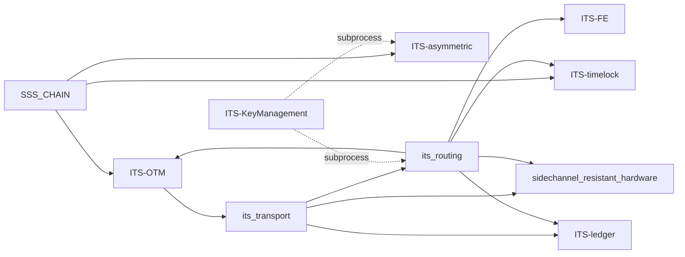

# ITS Ecosystem — Constitution (single entry)

## License: GNU GPLv3 Only

**Read this document first.** UES v1.5 model: [ITS-routing_UNATTACKABLE_MODEL.md](ITS-routing_UNATTACKABLE_MODEL.md). **Master cert:** `networkEcosystemCertificateV9` in [`mathematics/MasterTheoremV6.lean`](mathematics/MasterTheoremV6.lean) — gate `./scripts/verify_math.sh` (M1–M20). DoD + build checklist: `.cursor/plans/its_dod_postulates_v7_ca308ef5.plan.md`. Execution plan: `.cursor/plans/its_ecosystem_masterplan_5f896348.plan.md`.

---

## UES v1.5 transport modes (default)

| Mode | Command | Role |
|------|---------|------|
| **P — UES Monocell Pool** | `client-send/receive --pool` (default) | Primary ITS net — 1 epoch, 0 hops |
| **AEH — last-resort** | `client-send/receive --aeh` (manual) | Pool-protocol ban; φ ~ 𝒟_benign |
| **Mix/UDP** | `dev-onion-mix` / `dev-direct-udp` features | Dev-only regression |

---

## ITS = Information-Theoretic Secrecy

**ITS is not “infrastructure,” “separation,” or anything else.** In this ecosystem, **ITS always means Information-Theoretic Secrecy** — the Shannon property that ciphertext (or wire traffic) reveals **zero** bits about plaintext to an adversary with unbounded compute.

| Term | Meaning |
|------|---------|
| **ITS** | **Information-Theoretic Secrecy** — the security property |
| **`ITS-*` repo names** | Components that implement or compose ITS (wire, OTM, timelock, transport, …) |
| **This constitution** | How those repos stay layered, pipeable, and proof-aligned — **operator CLI law:** [ITS_CONSTITUTION_CLI.md](ITS_CONSTITUTION_CLI.md) |

Wire confidentiality, SSS backward ambiguity, WC-MAC attestation, and timelock deniability are **different faces of ITS** on different layers — not alternate definitions of the acronym.

**Constitution vs Advanced:** Default operators follow [ITS_CONSTITUTION_CLI.md](ITS_CONSTITUTION_CLI.md). I2P/Nym switch map: [ITS_OVERLAY_SWITCH.md](ITS_OVERLAY_SWITCH.md). Optional ridges (OTM, timelock, ledger, FE, hardware) are documented in [ITS_ADVANCED_RIDGES.md](ITS_ADVANCED_RIDGES.md) — not part of the seven essentials.

---

## Four ITS channels (C1–C4)

**Replacement matrix:** [ITS_INFRASTRUCTURE_REPLACEMENT.md](ITS_INFRASTRUCTURE_REPLACEMENT.md)

| Channel | Eve learns 0 bits about | Owner repo | Status v1.1 |
|---------|-------------------------|------------|-------------|
| **C1 Payload** | Plaintext on channel/disk | ITS-asymmetric (+ ITSKMV3 vault seal) | Wire Lean K8 done; vault Fase 1 |
| **C2 Integritet** | Tag/cert forgery | ITS-OTM (WC-MAC ITS) | Done |
| **C3 Anonymitet** | Traffic deanonymization | ROUTING (`its_transport`) | **UES Pool v1.5** — epoch_cell + L3/L3'; math spec: [ITS-routing_MATHEMATICAL_CORE.md](ITS-routing_MATHEMATICAL_CORE.md) |
| **C4 Benægtelighed** | Proof under coercion | ITS-timelock L2 (SSS underbestemmelse) | Done; L1 RSW = delay aux only |

**Aux (isolated):** RSW squaring loop = time wall only — carries no wire secret.

---

## CIA mitigations vs Eve 99.999%+ (routing summary)

Under axiom A0, Eve owns ≥ 99.999% of nodes. ROUTING's v9 certificate (`networkEcosystemCertificateV9`) proves **100% ITS** on all three pillars when A2/A2′ holds. **Full worked examples with numbers:** [ITS-routing_MATHEMATICAL_CORE.md](ITS-routing_MATHEMATICAL_CORE.md) §Va.

| Pillar | Channel / mechanism | Numeric sketch | Lean |
|--------|---------------------|----------------|------|
| **C1 Payload** | Shannon wire + L3 pool | \(I(M;O)=0\) bits; \(10^9\) Sybil ⇒ +0 bits | `WireComposition`, `SybilDoctrine` |
| **C2 Integritet** | WC-MAC OTM | \(P(\text{forge}) \leq 1/2.147\times10^9\); \(10^{12}\) tries ⇒ ≤465 expected | `IntegrityAxiom` → `Otm.OtmIntegrity` |
| **C3 Anonymitet** | UES pool, 0 hops | Author/recipient/flow zero in \(O\), \(IP_{obs}\) | `UnifiedEpochStream`, `BroadcastIPSymmetry` |
| **C4 Benægtelighed** | Timelock SSS L2 | Coercion underdetermination (no numeric floor) | `Stl.Security.Deniability` |
| **ITS-A (A)** | ValidFwd + witness k-of-n | 1 mirror in \(\mathcal{M}_{\text{valid}}\) suffices vs \(10^9\) Eve nodes | `ValidForwardParty`, `WitnessConsensus`, `ForwardReceiveGate` |

**Outside:** both endpoints compromised; \(\mathcal{M}_{\text{valid}}=\emptyset\) without witness; total blackout \(O_{\text{net}}=\emptyset\).

**PA.6 Sybil-whitelist:** evil mirrors that omit leave \(\mathcal{M}_{\text{valid}}\); Sybil forwarders that sync correctly stay whitelisted but add **zero** C/I bits.

---

## ITS-first charter

1. **Wire confidentiality** = Shannon ITS — Lean in [ITS-asymmetric](../ITS-asymmetric/ITS-asymmetric_FORMAL_VERIFICATION.md).
2. **SSS chaining** = single algebra in [SSS_CHAIN](../SSS_CHAIN/SSS_CHAIN_SECURITY_LAYERS.md).
3. **No computational fallback** as equivalent wire crypto in math repos.
4. **PQC/RSA** = out of math-klippe scope (centuries horizon, not four-decade hardness).
5. **Performance** (`compact-wire`) = faster ITS, not weaker ITS.
6. **One truth per concern** — no hidden monolith, no duplicate field math, one wire-FS story.
7. **Composable infrastructure** — each repo ships a **standalone CLI**; operators pipe, fork, or omit repos. No forced application stack.
8. **Freeze after v1.0.0** — math + transport change only on security fixes.

---

## Composable infrastructure (no forced stack)

This project is **alternative network infrastructure** — not a single application. Each concern is a prebuilt repo with its own CLI, man page, and shell completions. You compose what you need; nothing requires the full tree.

### Rules

| Rule | Meaning |
|------|---------|
| **Standalone CLIs** | Every operator tool runs alone: `its_asymmetric`, `its_otm`, `its_timelock`, `its_fe`, `its_ledger`, `its-routing`, `its-km` |
| **Pipe composition** | Connect via stdin/stdout (`-`) and shell pipes — see per-repo `*_PIPE.md` |
| **No compile coupling** | Math repos never depend on transport. KM never Cargo-depends on siblings. Routing default build is **transport only** |
| **Optional ridges** | Hardware, ledger, timelock, OTM, fingerprint-erasure are Cargo **features** on `its_routing`, not mandatory deps |
| **Fork-friendly** | Take one repo, ignore the rest, ship your own pipeline |

### Example pipelines (pick any subset)

```bash
# Wire only — no routing, no KM
its_asymmetric encrypt --pk bob.public.key --in doc.txt --out -

# Wire + OTM attestation — two CLIs, one pipe
its_asymmetric encrypt --pk bob.public.key --in doc.txt --out - \
  | its_otm sign --state alice.state --in - --out doc.otm

# Provenance erasure — standalone, no daemon
its_fe process --in photo.jpg --out clean.png --strict-stack

# Timelock — standalone, no routing
its_timelock generate --file secret.txt --epochs 5000 --out lock.its

# Transport only — minimal routing binary
cargo build -p its_routing --release

# Full operator daemon — opt in
cargo build -p its_routing --release --features full

# Convenience wrapper (optional) — KM orchestrates via PATH, not compile-time
its-km send --contact bob --file doc.txt
```

### When to use what

| Need | Use | Do not need |
|------|-----|-------------|
| Shannon encrypt | `its_asymmetric` | routing, KM, ledger |
| Public attestation | `its_otm` | asymmetric source (pipe bytes in) |
| Onion / UDP transport | `its-routing` (transport build) | full ridge features |
| Operator keyring | `its-km` | only if you want one-command send/receive |
| AEH hash feed | `its_ledger aeh fetch` | KM |
| Γ erasure | `its_fe` | routing (unless you want integrated send) |

**ITS-KeyManagement is optional glue** — for operators who want one vault and one send command. Power users pipe the math and transport CLIs directly.

---

## Three layers + ridges

| Layer | Repos | Security type | May depend on |
|-------|-------|---------------|---------------|
| **Constitution** | `ITS_ECOSYSTEM.md`, bootstrap, verify | Policy | — |
| **Math-klippe** (frozen v1.0.0) | SSS_CHAIN, ITS-asymmetric, ITS-OTM, ITS-timelock | Information-theoretic | SSS_CHAIN only (within math) |
| **Transport** | ROUTING (`its_transport`, `its_routing`) | Opaque bytes + transport ratchet | math via **OTM re-export** in `its_transport`; ridges at daemon edge |
| **Glue** | ITS-KeyManagement | Subprocess orchestration | **PATH only** — no sibling Cargo deps |
| **Operational ridges** | sidechannel_resistant_hardware, ITS-fingerprint_erasure, ITS-ledger | Honest scope per `*_SECURITY_LAYERS.md` | transport and/or math as documented |

### Allowed dependency edges (v1)



**Forbidden (layer violations):**

| Edge | Why forbidden |
|------|----------------|
| `its_routing` → `its_asymmetric` | Wire crypto stays in math; transport relays opaque bytes |
| `ITS-KeyManagement` → any ITS crate (Cargo) | Glue orchestrates via PATH, not compile-time coupling |
| Math → transport | Proofs must not depend on daemon/UDP |
| `SSS_CHAIN` → asymmetric/transport | Algebra is the root, not a consumer |

**Field algebra chain:** `SSS_CHAIN` → `ITS-OTM` → `its_transport::field_arith` (re-export). `ITS-asymmetric` re-exports `SSS_CHAIN` directly. No duplicate field implementation in active src.

---

## Layer rules (machine-checked)

`scripts/verify_ecosystem.sh` enforces:

| Rule | Meaning |
|------|---------|
| Active org only | No forbidden org references in `Cargo.toml` |
| Git tags, not path siblings | Reproducible deps — no `path = "../"` |
| Canonical module names | No retired import names in active src/tests |
| Constitution present | `ITS_ECOSYSTEM.md` exists |
| ITS definition | `ITS_ECOSYSTEM.md` defines ITS = Information-Theoretic Secrecy |
| Proof manifests | Each math repo has `PROOF_MANIFEST.md` |
| KM subprocess-only | KeyManagement has no sibling ITS Cargo deps |
| Math isolated from transport | Math crates do not depend on `its_transport` / `its_routing` |
| Routing has no wire crypto dep | `its_routing` does not depend on `its_asymmetric` |
| Routing canonical imports | `onion`, `sss_fragment`, `transport_otp_ratchet` — not alias paths |
| Infrastructure replacement doc | `ITS_INFRASTRUCTURE_REPLACEMENT.md` exists with C1–C4 |
| Routing math honesty | [ITS-routing_MATHEMATICAL_CORE.md](ITS-routing_MATHEMATICAL_CORE.md) is authoritative; [ITS-routing_mathematics.md](ITS-routing_mathematics.md) dev-only onion — no Shannon ITS without Lean ref |
| Vault ITS-only | No Argon2/ITSKMV2 in KM/ledger src |
| Transport ratchet ITS | No HKDF/PBKDF on transport ratchet path |

---

## Repo register

| Repo | Crate | Owns | Must NOT own |
|------|-------|------|--------------|
| [SSS_CHAIN](../SSS_CHAIN) | `sss_chain` | Field, Lagrange, link, epoch, OTM helpers | Wire encrypt, transport |
| [ITS-asymmetric](../ITS-asymmetric) | `its_asymmetric` | Shannon wire, bundle, epoch FS | Onion, contacts |
| [ITS-OTM](../ITS-OTM_public_attestation) | `its_otm_public_attestation` | WC-MAC attestation | Wire OTP body |
| [ITS-timelock](../ITS-self_enclosed_timelock) | `its_self_enclosed_timelock` | RSW delay + SSS ITS L2 | Transport |
| [ROUTING/its_transport](its_transport) | `its_transport` | Onion, fragment, transport ratchet, tunnel | Shannon wire |
| [ROUTING/its_routing](its_routing) | `its_routing` | Daemon, UDP, chaff, pipes | Crypto proofs, vault |
| [ITS-KeyManagement](../ITS-KeyManagement) | `its_keymgmt` | Vault, contacts, send/receive glue | Shannon implementation |
| [ITS-CHAT](../ITS-CHAT) | `its_chat` | IRC rooms (broadcast/chat/hidden_vote), frames, mute, vote | Wire math, transport |
| [ITS-MEMORY](../ITS-MEMORY) | `its_memory` | Neutral wire mirrors (`ITS-MEMORY-PIN/1`), SSS activity head (`ITS-COIN/1` via `sss_chain`) | Frame semantics, decrypt |
| [sidechannel_resistant_hardware](../sidechannel_resistant_hardware) | `its_hardware` | TRNG, seL4, Lorenz HAL, analog shares | Wire proofs |
| [ITS-ledger](../ITS-ledger) | `its_ledger` | Endpoint vault, AEH hash fetch | Operator keyring |
| [ITS-fingerprint_erasure](../ITS-fingerprint_erasure) | `its_fingerprint_erasure` | Γ normalization | Wire ITS |

**Rules:** ROUTING has **no** Cargo dep on `its_asymmetric`. KeyManagement has **no** Cargo dep on sibling ITS crates.

---

## Wire forward secrecy (v1.1)

| Mechanism | Role |
|-----------|------|
| `its_asymmetric epoch-advance` | Wire FS (SSS_CHAIN) — C1 |
| `its_transport::TransportOtpRatchet` | Transport/onion/AEH FS (SSS epoch step) — C3 |

No HKDF/PBKDF/Argon2 on ITS hot path (vault seal or transport ratchet).

---

## Proof manifests

| Repo | Document |
|------|----------|
| ITS-asymmetric | [PROOF_MANIFEST.md](../ITS-asymmetric/PROOF_MANIFEST.md) |
| SSS_CHAIN | [PROOF_MANIFEST.md](../SSS_CHAIN/PROOF_MANIFEST.md) |
| ITS-OTM | [PROOF_MANIFEST.md](../ITS-OTM_public_attestation/PROOF_MANIFEST.md) |
| ITS-timelock | [PROOF_MANIFEST.md](../ITS-self_enclosed_timelock/PROOF_MANIFEST.md) |

---

## Lorenz ownership

**Implementation:** `its_transport::lorenz` (onion mixing-node delay). **HAL API:** sidechannel_resistant_hardware re-exports the same module for TRNG/chaff timing tests. No duplicate `lorenz.rs` in hardware.

---

## Operator CLIs

Every operator-facing binary ships bash, zsh, fish, and PowerShell completions plus a man page.

| Binary | Repo | Role |
|--------|------|------|
| `its-km` | ITS-KeyManagement | Operator keyring, send/receive glue |
| `its_asymmetric` | ITS-asymmetric | Shannon wire encrypt/decrypt |
| `its-routing` | ROUTING | Transport daemon and pipes |
| `its_otm` | ITS-OTM | OTM public attestation |
| `its_timelock` | ITS-timelock | Work-bounded time-lock puzzles |
| `its_fe` | ITS-fingerprint_erasure | Provenance erasure (Γ) + OTP mask |
| `its_ledger` | ITS-ledger | Endpoint vault, registry, AEH hash feed |
| `sss_chain` | SSS_CHAIN | SSS link chain dev tool |

Install pattern (example):

```bash
source completions/its_otm.bash    # bash/zsh
cp completions/its_otm.fish ~/.config/fish/completions/
. ./completions/its_otm.ps1        # PowerShell
man -l man/its_otm.1
```

---

## Documentation per repo

Each repo follows the same pillar layout: **SECURITY_LAYERS** (read first) → vision → mathematics → manual → troubleshooting → HEADS_UP.

| Repo | Entry | Manual |
|------|-------|--------|
| SSS_CHAIN | README | `SSS_CHAIN_manual.md` |
| ITS-asymmetric | README | `ITS-asymmetric_manual.md` |
| ITS-OTM | README | `ITS-OTM_public_attestation_manual.md` |
| ITS-timelock | README | `ITS-self_enclosed_timelock_manual.md` |
| ROUTING | [ITS-routing_MATHEMATICAL_CORE.md](ITS-routing_MATHEMATICAL_CORE.md) · README | `ITS-routing_manual.md` |
| ITS-KeyManagement | README | `ITS-KeyManagement_manual.md` |
| sidechannel_resistant_hardware | README | `ITS-hardware_manual.md` |
| ITS-ledger | README | `ITS-ledger_manual.md` |
| ITS-fingerprint_erasure | README | `ITS-fingerprint_erasure_manual.md` |

---

## Two vaults (do not confuse)

| | **ITS-KeyManagement** | **ITS-ledger** |
|--|----------------------|----------------|
| Binary | `its-km` | `its_ledger` |
| Default path | `~/.its/km.vault` | operator-chosen file |
| Holds | Contacts, OTM certs, send/receive profiles, duress view | Endpoint registry blobs, peer pools |
| Crypto | **ITSKMV3** (Shannon ITS via `its_asymmetric` wire seal) | **ITSLV3** (same wire-seal pattern) |
| Who uses it | Human operator daily | Transport endpoint / sync daemon |
| AEH | No | `its_ledger aeh fetch` feeds routing |

**Rule:** Operator identity and contacts → **KM**. Endpoint-side registry at rest + public hash feed → **ledger**.

---

## Ledger: separate repo (decision)

**Keep ITS-ledger as its own repo** — do not merge into ROUTING.

| Reason | Detail |
|--------|--------|
| Honest scope | AEH + endpoint storage ≠ operator keyring; own SECURITY_LAYERS |
| Proof boundary | Ledger at-rest is computational; wire math stays in asymmetric |
| Reuse | `its_ledger` CLI and library usable without full routing daemon |

**Compile coupling:** `its-routing` may use ledger for AEH, but ledger is now an **optional Cargo feature** — not mandatory at build time.

Standalone workflow: `its_ledger aeh fetch` · `its_timelock generate` (timelock repo) without building routing.

---

## Routing build profiles

Default `its_routing` build is **transport only** — ridges are opt-in. This matches composable infrastructure: you add only what your pipeline needs.

| Profile | Command | What you get |
|---------|---------|--------------|
| **Transport** (default) | `cargo build -p its_routing` | Onion, SSS fragment, AEH core, client-send/receive |
| **Full daemon** | `cargo build -p its_routing --features full` | Transport + all operational ridges |
| **Custom** | `cargo build -p its_routing --features timelock,ledger` | Transport + selected ridges only |

| Feature | Enables |
|---------|---------|
| `full` | All ridges below (convenience bundle) |
| `hardware` | TRNG via sidechannel_resistant_hardware, analog share export/import |
| `ledger` | Live blockchain hash fetch for AEH |
| `timelock` | `time-lock`, `time-unlock`, `time-deny` subcommands |
| `otm` | OTM tag verification on AEH blocks |
| `fingerprint-erasure` | Γ on send + `fingerprint-erasure` subcommand |

Disabled subcommands print a clear rebuild hint: `cargo build -p its_routing --features <name>`.

Ecosystem verify uses `--features full` when testing the complete routing binary.

---

## Build & verify

**Pre-build doctrine v2.0:** [ITS-routing_PREBUILD_DOCTRINE.md](ITS-routing_PREBUILD_DOCTRINE.md) · Docker: [deploy/docker/docker-compose.yml](deploy/docker/docker-compose.yml) · Nix: [flake.nix](flake.nix) · Firecracker: [deploy/firecracker/README.md](deploy/firecracker/README.md)

```bash
./scripts/bootstrap.sh      # clone 0x1F980 ecosystem (tags)
./scripts/verify_ecosystem.sh /home/user
./scripts/install_completions.sh --all   # constitution + optional ridges
```

**Product docs (Sprint 5):** [ITS_OVERLAY_SWITCH.md](ITS_OVERLAY_SWITCH.md) · [docs/ITS_DOMINANCE_PITCH.md](docs/ITS_DOMINANCE_PITCH.md) · [ITS_HIDDEN_SERVICE.md](ITS_HIDDEN_SERVICE.md) · [ITS-routing_SOCKS_EGRESS.md](ITS-routing_SOCKS_EGRESS.md) · [ITS-routing_DEPLOY_MATH_GATES.md](ITS-routing_DEPLOY_MATH_GATES.md) · [deploy/COMMUNITY_MIRRORS.md](deploy/COMMUNITY_MIRRORS.md) · [RELEASE.md](RELEASE.md) · [ITS-routing_STANDARD_REPLACEMENT.md](ITS-routing_STANDARD_REPLACEMENT.md) · [ITS-routing_OVERLAY_EXTINCTION.md](ITS-routing_OVERLAY_EXTINCTION.md) · [ITS_MIGRATION_GUIDES.md](ITS_MIGRATION_GUIDES.md)

---

## Ecosystem tag `ecosystem-v1.0.0-complete` (Sprint 6 — prep only)

**Criteria (do not tag without operator confirmation):**

| # | Requirement |
|---|-------------|
| 1 | `./scripts/verify_math.sh` green (M1–M20) |
| 2 | `./scripts/verify_ecosystem.sh` green (M17–M22, P8.*) |
| 3 | Sibling repos pushed at matching `v1.0.0` tags |
| 4 | [ITS_INDEPENDENT_REVIEW_CHECKLIST.md](ITS_INDEPENDENT_REVIEW_CHECKLIST.md) executed on tagged release |
| 5 | Meta-tag `ecosystem-v1.0.0-complete` on all ecosystem repos |

Full checklist: [PROOF_MANIFEST.md](PROOF_MANIFEST.md) — Ecosystem tag criteria section.

---

## Organization

Active development: **0x1F980** on GitHub.

---

## Out of v1 math scope

PQC/RSA wire alternative · ITS-garbled/MPC · Web PKI/TLS · FIPS module as math replacement · monorepo
