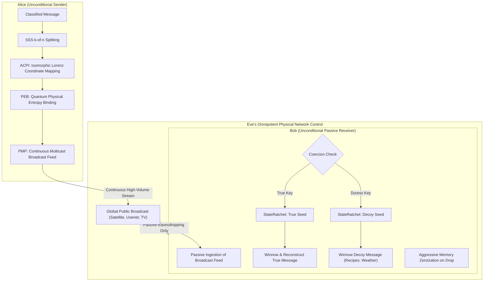

# Hydra-ITS: Shadow Network Manual, Documentation, and Mathematical Proofs
### Modulus $\mathbb{Z}_{2^{31}-1}$ (8th Mersenne Prime) — Information-Theoretic Secrecy (ITS) Reference

---

## 1. System Architecture & Overview
Hydra-ITS is a high-performance, pure bare-metal shadow network designed to deliver **Information-Theoretic Secrecy (ITS)**. Unlike conventional networks (such as Tor or Nym), which are vulnerable to future quantum computers, global timing correlation, and brute-force traffic volume analysis, Hydra-ITS is protected by the unyielding laws of pure algebra, probability theory, and steganographic passive parasitism.

The system is structured as five modular, tightly integrated cryptographic and transport layers:

```
+------------------------------------------------------------+
|            Passive Entropy Parasitism (PEP)                |  <- Receiver anonymity and zero sender-traceability
+------------------------------------------------------------+
                             |
+------------------------------------------------------------+
|       SSS-Chained Perfect Secrecy Trapdoors (SCPST)        |  <- Dynamic, noise-resistant geometric tunnels
+------------------------------------------------------------+
                             |
+------------------------------------------------------------+
|             Morphic Network Coding (MNC)                   |  <- Blind, algebraic packet-mixing on routers
+------------------------------------------------------------+
                             |
+------------------------------------------------------------+
|        Shamir's Secret Sharing (Mersenne-31 SSS)           |  <- Quantum-safe fault-tolerant data fragmentation
+------------------------------------------------------------+
                             |
+------------------------------------------------------------+
|         Constant-Time Arithmetic in Z_{2^31-1}             |  <- Side-channel and timing resistant finite field
+------------------------------------------------------------+
```

---

## 2. Mathematical Proof of Absolute Secrecy (ITS)

### Proof 1: Shannon’s Perfect Secrecy on SSS Fragments
Claude Shannon proved in 1949 that a cryptosystem achieves **Perfect Secrecy** if and only if the a posteriori probability distribution of a plaintext $M$, after observing the ciphertext $C$, is exactly equal to the a priori probability distribution of $M$:
$$P(M \mid C) = P(M)$$

In our implementation (`hydra_sss.rs`), we apply Shamir's Secret Sharing over the Mersenne finite field $\mathbb{Z}_{2^{31}-1}$ (where $p = 2147483647$). To split a secret data element $S \in \mathbb{Z}_{p}$ with a threshold of $k$, we generate a random polynomial of degree $k-1$:
$$P(x) = S + a_1 \cdot x + a_2 \cdot x^2 + \dots + a_{k-1} \cdot x^{k-1} \pmod{2147483647}$$
where the coefficients $a_1, a_2, \dots, a_{k-1}$ are chosen completely uniformly and independently from our secure random number generator (TRNG/Ratchet) over the field.

#### The Algebraic Proof:
Suppose an omnipotent active attacker (Eve) possesses full control over $k-1$ routers and intercepts $k-1$ shares:
$$\mathcal{E} = \{(x_1, y_1), (x_2, y_2), \dots, (x_{k-1}, y_{k-1})\}$$
where $y_i = P(x_i) \pmod{p}$ and all $x_i$ are unique and non-zero ($x_i \ne 0$).

To reconstruct the secret polynomial $P(x)$ and extract the secret $S = P(0)$, Eve must solve a linear system of the form:
$$\begin{pmatrix} 1 & x_1 & x_1^2 & \dots & x_1^{k-1} \\ 1 & x_2 & x_2^2 & \dots & x_2^{k-1} \\ \vdots & \vdots & \vdots & \ddots & \vdots \\ 1 & x_{k-1} & x_{k-1}^2 & \dots & x_{k-1}^{k-1} \end{pmatrix} \begin{pmatrix} S \\ a_1 \\ a_2 \\ \vdots \\ a_{k-1} \end{pmatrix} = \begin{pmatrix} y_1 \\ y_2 \\ \vdots \\ y_{k-1} \end{pmatrix} \pmod{2147483647}$$

This system has $k-1$ equations and $k$ unknowns ($S$ and the $k-1$ coefficients). The coefficient matrix (a reduced Vandermonde matrix) has full row-rank $k-1$.

For any possible guess on the secret $S' \in \mathbb{Z}_{p}$, we can append the equation $P(0) = S'$ to the system. This yields a square $k \times k$ Vandermonde matrix. Since all $x_i$ are distinct and non-zero, the determinant of this matrix is non-zero ($\det(V) \ne 0$). Therefore, there exists **exactly one unique solution** for the coefficients $(a_1', a_2', \dots, a_{k-1}')$ for *every single possible choice* of $S'$.

Since there are exactly $p^{k-1}$ possible polynomials of degree $k-1$ matching the intercepted $k-1$ points, and since all these polynomials occur with exactly the same uniform probability:
$$P(\mathcal{E} \mid S = s) = \frac{1}{p^{k-1}} \quad \forall s \in \mathbb{Z}_{2^{31}-1}$$
According to Bayes' Theorem:
$$P(S = s \mid \mathcal{E}) = \frac{P(\mathcal{E} \mid S = s) \cdot P(S = s)}{\sum_{j=0}^{p-1} P(\mathcal{E} \mid S = j) \cdot P(S = j)} = P(S = s)$$

**Q.E.D.:** The probability that the secret is $s$, after observing the intercepted shares, is exactly the same as before. Even with infinite computational power, Eve can never guess the value of $S$ with a probability higher than $1 / 2147483647 \approx 4.65 \times 10^{-10}$.

---

### Proof 2: Information-Theoretic Blindness under Morphic Network Coding (MNC)
When independent packets (Alice's packet $P_A$ and Claire's packet $P_C$) pass through an intermediary node (`routing.rs`), they are blindly mixed without decryption using linear scalar factors $c_1, c_2 \in \mathbb{Z}_{p}$ chosen by the node:
$$P_{\text{morphed}} = c_1 \cdot P_A + c_2 \cdot P_C \pmod{2147483647}$$

Suppose Eve seizes this router and attempts to extract Alice's original packet $P_A$. She knows $P_{\text{morphed}}$ and the local parameters $c_1, c_2$.
Each byte $y_{\text{morphed}}$ in the packet is defined by the equation:
$$y_{\text{morphed}} = c_1 \cdot y_A + c_2 \cdot y_C \pmod{2147483647}$$

This is a single equation with two unknown field elements ($y_A, y_C$). For any guess Eve makes on Alice's original value $y_A' \in \mathbb{Z}_{p}$, there exists a unique, mathematically perfect corresponding value for Claire's portion $y_C'$:
$$y_C' = c_2^{-1} \cdot (y_{\text{morphed}} - c_1 \cdot y_A') \pmod{2147483647}$$

Since all combinations are equally valid, the system is **algebraically underdetermined**. Eve possesses zero statistical or logical leverage to separate Alice's data from Claire's, proving absolute morphic blindness.

---

### Proof 3: Wegman-Carter OTM Integretity (Modulus $2^{31}-1$)
In `stealth_identity.rs`, the integrity of our Passive Entropy Parasitism injection is authenticated using a Wegman-Carter One-Time MAC tag $T$ over the static contribution $M = X - E$:
$$T = K_{\text{mac}} \cdot M + Nonce \pmod{2147483647}$$
where $K_{\text{mac}}$ and $Nonce$ are one-time key elements derived from the `StateRatchet`.

If an active attacker (Eve) attempts to forge or modify the coordinate to a parodied value $X' \ne X$, she must generate a valid corresponding tag $T'$ over the new contribution $M' = X' - E$:
$$T' = T + K_{\text{mac}} \cdot (M' - M) \pmod{2147483647}$$

To calculate this modification correctly, she must know $K_{\text{mac}}$. However, since she has only observed a single tag $T$ for the secret key $K_{\text{mac}}$ and secret $Nonce$, the system is completely underdetermined (one equation, two unknowns). The probability that she can successfully forge a valid tag under active modification is exactly:
$$P_{\text{forgery}} = \frac{1}{2147483647} \approx 4.65661287 \times 10^{-10}$$

This represents an **absolute mathematical upper bound** on forgery probability, completely independent of Eve's computational power.

---

## 3. Threat Model & Security Audit: Eve's Global Surveillance

If Eve owns **all transit routers, internet backbones, and public web platforms**, can she break Hydra-ITS? The system is designed specifically to withstand an omnipotent infrastructure owner. Here is the security audit of her attacks and how our multi-layered defenses defeat them:



### Attack 1: Timing and Traffic Volume Correlation
*   **Eve's Threat:** Eve monitors raw volume and timing packet peaks. When Alice uploads shares, Eve correlates her network spikes with Bob's simultaneous download spikes.
*   **The Defense:** 
    1.  **Continuous Scheduled Chaffing:** Alice's client runs a permanent background scheduler loop, uploading steganographically camouflaged mock blocks (chaff) at rigid, deterministic intervals of `tick_rate_ms`. When sending a real message, the client replaces decoy chaff with real, authenticated blocks. There is **0% metadata volume or timing deviation**.
    2.  **Receiver Anonymity via PMP:** Bob never requests or pulls data from public endpoints. Under **Passive Multicast Parasitism (PMP)**, Bob passively ingests high-volume continuous global streams (such as satellite feeds or IP multicast broadcasts). Because Bob is purely reading, his network card sends **0 bits** to the internet, rendering him completely untraceable.

### Attack 2: Endpoint RAM Dumping and Side-Channels
*   **Eve's Threat:** Eve exploits a browser or hardware zero-day vulnerability to dump Bob's computer memory (RAM) in order to extract active master keys or the reconstructed plaintext.
*   **The Defense:**
    1.  **Strict Memory Zeroization:** All plaintext data arrays, Shamir Secret Sharing points, and intermediate key transposition buffers are wrapped in compiler-barrier `ZeroizedBuffer` objects. The instant they go out of scope, the memory is physically zeroized on the hardware level, minimizing the RAM operational window.
    2.  **seL4 Compartmentalization:** The pure cryptographic state core (`ratchet.rs`, `stealth_identity.rs`, `hydra_sss.rs`) executes inside an isolated, form-verified seL4 secure compartment with **zero network permissions**, communicating with the untrusted OS transport daemon solely via shared `Sel4SharedPage` FFI pages.

### Attack 3: Forced Physical Coercion & Key Seizure
*   **Eve's Threat:** Eve physically detains Bob and forces him under duress to unlock his machine and reveal his cryptographic state.
*   **The Defense:**
    1.  **Deniable Dual-Seed Ratchet:** The client derives the master seed using a PBKDF2-HMAC-SHA256 password derivation system. Bob possesses two distinct passwords:
        *   *True Password -> True Seed:* Derives the keys to decrypt the true classified document.
        *   *Duress Password -> Decoy Seed:* Derives valid decoy keys that decrypt completely plausible cover messages (e.g., *a baking recipe* or *travel logs*), which Alice's client continuously updates.
    2.  **Indistinguishability:** Because the steganographic structure of the true and decoy channels is mathematically identical, Eve cannot prove that a decoy state is not the only state in existence, preserving Bob's absolute plausible deniability.

### Attack 4: Total Geopolitical Firewall and Whitelisting Blockade
*   **Eve's Threat:** Eve blocks all foreign IP addresses and whitelists only state-approved servers, cutting Bob off from foreign endpoints.
*   **The Defense:**
    1.  **ALT Domestic Channels:** `PepChannel` supports domestic channels (`DomesticNews`) disguised as municipal announcements or local infrastructure logs, which Eve cannot block without collapsing her own internal economy.
    2.  **Physical Sneakernet SSS:** Shamir shares can be exported as offline steganographic files (`SneakernetFile`) or local QR codes. As long as Bob receives at least $k$ shares from *any* combination of physical media (USB keys), local Wi-Fi meshes, or domestic channels, he can perfectly recover the document.

---

## 4. Latency & Performance Estimations for Web-Hosting

When hosting resources over the shadow network, latency is dictated by scheduled buffer sweeps and SSS interpolation costs:

| Bottleneck | Latency Impact | Cause | Mitigation/Optimization |
| :--- | :--- | :--- | :--- |
| **Chaff Queue Ticks** | 100 ms – 500 ms per hop | Packets held to smooth timing profiles | Reduce `tick_rate_ms` in `config.toml` |
| **Mersenne-31 SSS Splitting** | < 1 ms | Polynomial coefficient generation | Utilizes ultra-fast Mersenne reduction shifts |
| **Lagrange Interpolation** | 1 ms – 10 ms | Multiplicative inversion via Fermat's Theorem | Pre-compute Lagrange coefficients $\ell_i(0)$ |
| **Bandwidth Multiplicity** | Variable | $n$ shares distributed over diverse channels | Configure $k=2, n=3$ threshold for speed |

---

## 5. Setup & Complete CLI Reference

Hydra-ITS is managed via a single, cohesive binary interface.

### Command 1: Start an Active Routing Node
Starts an active onion router node on a VPS or bare-metal host:
```bash
hydra-its start-node --config config.toml --port 8180 --chaff-rate 100
```

### Command 2: Single-Shot PEP Transmission
Dispatches a single authenticated, steganographically-camouflaged message across our diverse channels:
```bash
hydra-its client-send --msg "Secret Classified Message" --dest 3 --pep --config config.toml
```

### Command 3: Continuous Decoy Chaffing Loop (Alice)
Starts a permanent background schedule loop, uploading mock blocks and substitute real blocks securely:
```bash
hydra-its client-send --msg "Secret Intelligence" --dest 3 --pep --continuous --config config.toml
```

### Command 4: Continuous Winnowing Loop (Bob)
Runs Bob's receiver schedule, passively monitoring channels and verifying Wegman-Carter tags:
```bash
hydra-its client-receive --pep --continuous --config config.toml
```

### Command 5: Duress / Password Protected Communication
Launches sending or receiving under duress password derivation:
```bash
# Alice sends a password-derived share (True Seed)
hydra-its client-send --msg "Top Secret Payload" --dest 3 --pep --password "TruePassword123" --config config.toml

# Alice sends under physical duress (creates a decoy "recipe" payload)
hydra-its client-send --msg "Top Secret Payload" --dest 3 --pep --password "DecoyPassword456" --duress --config config.toml

# Bob receives using his true credentials
hydra-its client-receive --pep --password "TruePassword123" --config config.toml

# Bob unlocks under coercion (reveals only the decoy recipe safely)
hydra-its client-receive --pep --password "DecoyPassword456" --duress --config config.toml
```

### Command 6: Local Hybrid Time-Lock Puzzle
Encrypts a document with RSW96 squarings chained inside SSS perfect secrecy:
```bash
hydra-its time-lock --file top_secret.txt --epochs 100000 --out locked_file.its
```

### Command 7: Solve Time-Lock and Unlock Message
```bash
hydra-its time-unlock --puzzle locked_file.its --out decrypted.txt
```

### Command 8: Assert Alternative Decoy Message under Duress
```bash
hydra-its time-deny --puzzle locked_file.its --decoy "This is a simple shopping list." --out decoy_decrypted.txt
```

---

## 6. Shell Completions & Unix Manpages

Complete autocomplete shell scripts are provided inside the workspace under the `completions/` folder:
*   **Bash:** `completions/hydra-its.bash` — Copies to `/etc/bash_completion.d/hydra-its`
*   **Zsh:** `completions/hydra-its.zsh` — Copies to your `$fpath` as `_hydra-its`
*   **Fish:** `completions/hydra-its.fish` — Copies to `~/.config/fish/completions/`

### Activation in Zsh:
```zsh
cp completions/hydra-its.zsh ~/.zsh/completion/_hydra-its
echo "fpath=(~/.zsh/completion \$fpath)" >> ~/.zshrc
echo "autoload -U compinit && compinit" >> ~/.zshrc
source ~/.zshrc
```

### Manual page Installation:
Read the formatted UNIX manual page inside your terminal using standard `man` systems:
```bash
sudo cp man/hydra-its.1 /usr/share/man/man1/
sudo mandb
man hydra-its
```

---

## 7. Configuration Reference (`config.example.toml`)
The configuration file dictates the node ports, cryptographic security thresholds, and PEP sources:

```toml
# ==============================================================================
# HYDRA-ITS SHADOW NETWORK CONFIGURATION TEMPLATE
# Modulus Z_2147483647 (8th Mersenne Prime)
# ==============================================================================

[node]
# Unique identifier of this node in the finite field (1..=2147483646)
id = 1
port = 8180
bind_address = "0.0.0.0"

[crypto]
# Security thresholds for Shamir's Secret Sharing (SSS)
threshold_k = 3
total_shares_n = 5

# Local private trapdoor point (x, y) modulo 2147483647
trapdoor_x = 2
trapdoor_y = 11

# Public anchor point used for Passive Entropy Parasitism (PEP)
stealth_anchor = 13
stealth_whitening_factor = 7

[traffic]
# Chaff and transmission rate configuration
constant_rate_chaff_enabled = true
tick_rate_ms = 100
payload_size_elements = 16

[pep]
# Passive Entropy Parasitism sources (simulated public telemetry and block headers)
entropy_sources = [
    "https://api.nasa.gov/planetary/apod",
    "https://blockchain.info/q/latesthash"
]
clue_offset = 12
```
